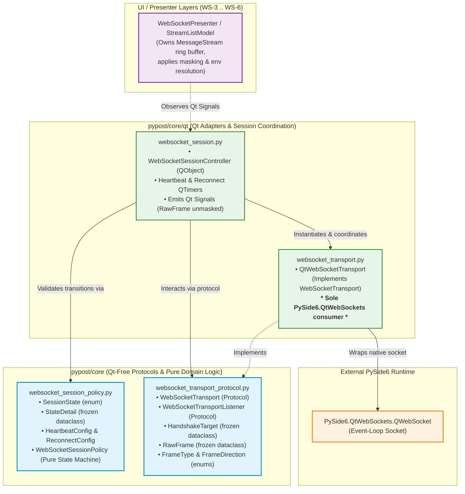
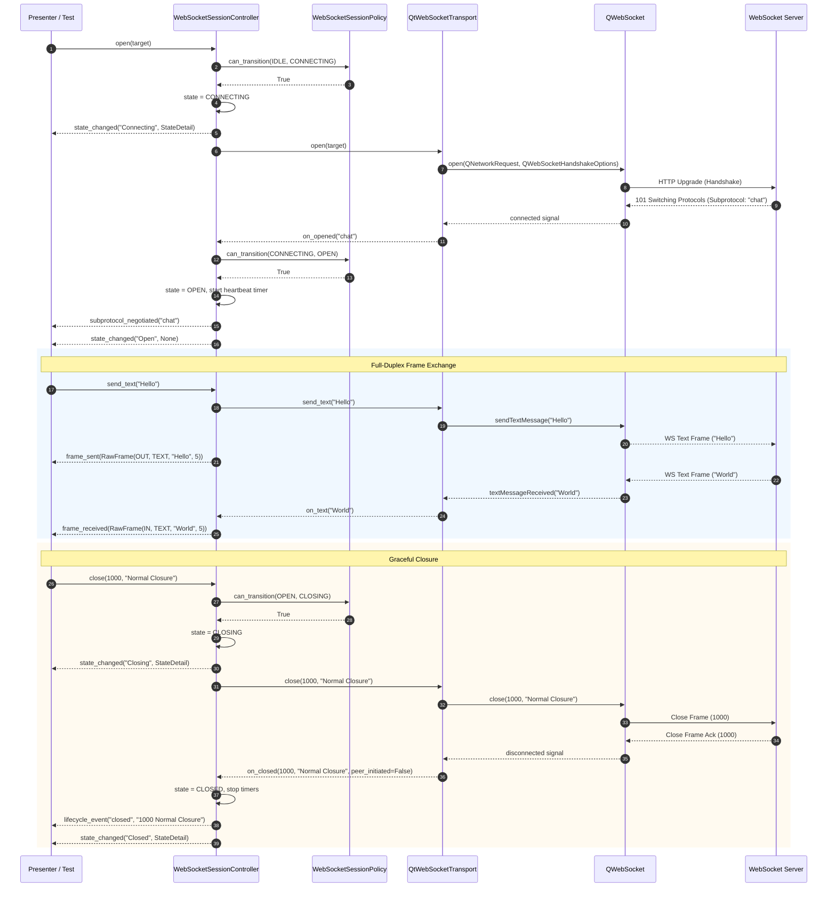
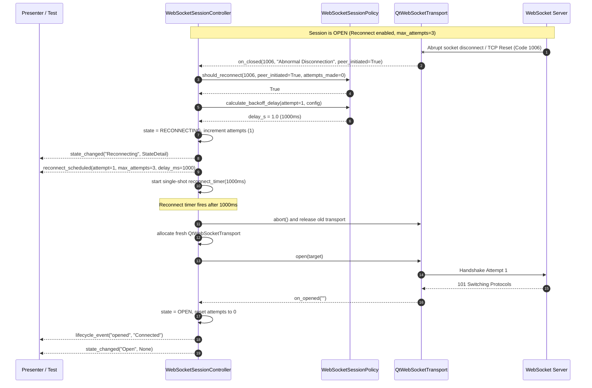
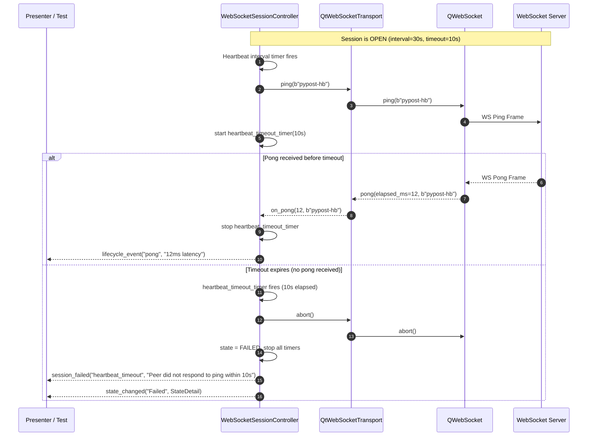

# WebSocket Transport Seam and Session Engine

## Overview

PyPost provides an asynchronous, event-driven WebSocket core engine (**WS-1**, Epic PYPOST-1123) for connecting to WebSocket servers (RFC 6455), executing full-duplex message exchanges, monitoring transport health via automated heartbeats, and handling unexpected connection drops with bounded exponential backoff.

The engine is engineered with strict architectural isolation:
- **Qt-Free Seam & Pure Policy**: Abstract transport contracts, frame data models, and the session state machine reside in `pypost/core/` with zero Qt dependencies.
- **Quarantined Qt Adapter**: `PySide6.QtWebSockets` is strictly quarantined within a single adapter module (`pypost/core/qt/websocket_transport.py`), preventing QtWebSockets leakage across the codebase.
- **Decoupled Session Controller**: The headless Qt coordinator (`pypost/core/qt/websocket_session.py`) orchestrates timers, state transitions, and transport lifecycles, emitting unmasked `RawFrame` signals without coupling to UI widgets, ring buffers, or secret masking policies.

---

## Architecture

### System Module Diagram



---

## 4-Module Breakdown

The WebSocket engine is decomposed into four cohesive modules across `pypost/core/` and `pypost/core/qt/`:

| Module | Location | Dependencies | Primary Responsibilities |
|---|---|---|---|
| [`websocket_transport_protocol`](file:///home/src/pypost/core/websocket_transport_protocol.py) | `pypost/core/websocket_transport_protocol.py` | Python stdlib (`typing`, `dataclasses`, `enum`, `datetime`) | Defines abstract transport (`WebSocketTransport`) and listener (`WebSocketTransportListener`) protocols, immutable frame models (`RawFrame`), and handshake parameters (`HandshakeTarget`). **Zero Qt imports**. |
| [`websocket_session_policy`](file:///home/src/pypost/core/websocket_session_policy.py) | `pypost/core/websocket_session_policy.py` | Python stdlib (`dataclasses`, `enum`, `logging`, `random`, `typing`) | Pure state transition validation (`can_transition`), exponential backoff calculation with jitter (`calculate_backoff_delay`), and reconnect evaluation (`should_reconnect`). **Zero Qt imports**. |
| [`websocket_transport`](file:///home/src/pypost/core/qt/websocket_transport.py) | `pypost/core/qt/websocket_transport.py` | `PySide6.QtWebSockets`, `PySide6.QtCore`, `PySide6.QtNetwork`, `websocket_transport_protocol` | Concrete adapter implementing `WebSocketTransport` by wrapping `PySide6.QtWebSockets.QWebSocket`. Translates Qt signals into listener callbacks. **Sole importer of QtWebSockets**. |
| [`websocket_session`](file:///home/src/pypost/core/qt/websocket_session.py) | `pypost/core/qt/websocket_session.py` | `PySide6.QtCore` (`QObject`, `QTimer`, `Signal`), `websocket_transport_protocol`, `websocket_session_policy`, `websocket_transport` | Headless `QObject` controller coordinating connection lifecycles, ping/pong heartbeat `QTimer`s, reconnect backoff `QTimer`s, and emitting raw unmasked frame signals. |

---

## Sequence Diagrams

### 1. Connection Handshake, Duplex Frame Exchange, and Normal Closure



### 2. Network Drop and Bounded Exponential Reconnection



### 3. Heartbeat Ping-Pong and Timeout Handling



---

## State Transition Rules

The table below documents all allowable state transitions enforced by [`WebSocketSessionPolicy`](file:///home/src/pypost/core/websocket_session_policy.py):

| From State | To State | Trigger / Condition | Actions & Side Effects |
|---|---|---|---|
| `IDLE` | `CONNECTING` | Calling `open(target)` | Validates transition, allocates transport, initiates handshake. |
| `CONNECTING` | `OPEN` | Transport reports `on_opened` | Authoritative connection event. Starts heartbeat timer, emits `subprotocol_negotiated` if present. |
| `CONNECTING` | `FAILED` | Transport reports `on_failed` (e.g. handshake rejection, DNS failure, TLS failure) | Aborts socket, stops timers, emits `session_failed`. |
| `CONNECTING` | `CLOSED` | Caller calls `close()` / cancel while connecting | Aborts transport, stops timers, emits `state_changed("Closed")`. |
| `OPEN` | `CLOSING` | Caller calls `close(code, reason)` | Sends WebSocket close frame to remote peer, awaits clean disconnect. |
| `OPEN` | `CLOSED` | Remote peer initiates clean close frame (1000/1001) | Disconnects cleanly, stops heartbeat timer, emits `lifecycle_event("closed")`. |
| `OPEN` | `RECONNECTING` | Abrupt network drop (e.g. code 1006) with reconnect enabled and attempts < max | Computes exponential backoff delay with jitter, starts reconnect `QTimer`, emits `reconnect_scheduled`. |
| `OPEN` | `FAILED` | Abrupt network drop with reconnect disabled, OR heartbeat ping timeout | Stops timers, aborts transport, emits `session_failed`. |
| `CLOSING` | `CLOSED` | Remote close ACK received or socket disconnects | Releases transport, stops all timers. |
| `RECONNECTING` | `OPEN` | Reconnection handshake succeeds (`on_opened`) | Resets retry counter to 0, resumes heartbeat timer, emits `state_changed("Open")`. |
| `RECONNECTING` | `RECONNECTING` | Reconnect handshake fails and attempts < max | Schedules next backoff retry with scaled delay. |
| `RECONNECTING` | `FAILED` | Reconnection attempts exhausted (`attempts == max`) | Emits `session_failed("reconnect_exhausted")`. |
| `RECONNECTING` | `CLOSED` | Caller calls `close()` / cancel while reconnecting | Stops reconnect timer, transitions session to `CLOSED`. |
| `FAILED` | `CONNECTING` | Caller calls `open(target)` after failure | Resets state and retry counters, allocates fresh transport. |
| `CLOSED` | `CONNECTING` | Caller calls `open(target)` after closure | Resets state, allocates fresh transport. |

---

## API & Usage Examples

### 1. Constructing a `HandshakeTarget`

[`HandshakeTarget`](file:///home/src/pypost/core/websocket_transport_protocol.py) is a frozen, immutable dataclass containing all connection configuration:

```python
from pypost.core.websocket_transport_protocol import HandshakeTarget

# Target with custom headers, subprotocols, and 32MB max message cap
target = HandshakeTarget(
    url="wss://echo.example.com/v1/stream",
    headers={
        "Authorization": "Bearer eyJhbGciOi...",
        "X-Client-Version": "2.4.0",
    },
    subprotocols=("graphql-ws", "json"),
    max_incoming_message_bytes=32 * 1024 * 1024,  # 32 MB
    verify_tls=True,
)
```

### 2. Operating the `WebSocketSessionController`

[`WebSocketSessionController`](file:///home/src/pypost/core/qt/websocket_session.py) coordinates connection lifecycles, timers, and unmasked frame events:

```python
from PySide6.QtCore import QObject
from pypost.core.qt.websocket_session import WebSocketSessionController
from pypost.core.websocket_session_policy import HeartbeatConfig, ReconnectConfig
from pypost.core.websocket_transport_protocol import HandshakeTarget, RawFrame

controller = WebSocketSessionController()

# Connect to Qt signals
controller.state_changed.connect(
    lambda state_name, detail: print(f"Session State: {state_name} ({detail})")
)
controller.frame_received.connect(
    lambda frame: print(f"Received [{frame.payload_format.value}]: {frame.payload!r}")
)
controller.frame_sent.connect(
    lambda frame: print(f"Sent [{frame.payload_format.value}]: {frame.payload!r}")
)
controller.subprotocol_negotiated.connect(
    lambda subproto: print(f"Negotiated Subprotocol: {subproto}")
)
controller.reconnect_scheduled.connect(
    lambda attempt, max_attempts, delay_ms: print(
        f"Reconnecting attempt {attempt}/{max_attempts} in {delay_ms}ms"
    )
)
controller.session_failed.connect(
    lambda category, message: print(f"Error [{category}]: {message}")
)

# Open connection with heartbeat and auto-reconnect configurations
controller.open(
    target=HandshakeTarget(url="wss://echo.websocket.org", headers={}),
    heartbeat=HeartbeatConfig(interval_seconds=15.0, timeout_seconds=5.0),
    reconnect=ReconnectConfig(enabled=True, max_attempts=5, initial_delay_seconds=1.0),
)

# Send text and binary frames once OPEN
controller.send_text('{"type": "ping", "id": 1}')
controller.send_binary(b"\x00\x01\x02\x03\x04")

# Clean closure
controller.close(code=1000, reason="Normal Closure")
```

### 3. Working with `RawFrame`

[`RawFrame`](file:///home/src/pypost/core/websocket_transport_protocol.py) encapsulates directional, formatted frame payloads without transformation or masking:

```python
from pypost.core.websocket_transport_protocol import FrameDirection, FrameType, RawFrame

def handle_frame(frame: RawFrame) -> None:
    if frame.direction == FrameDirection.IN:
        print(f"Incoming {frame.payload_format.value} frame of {frame.byte_size} bytes")
    elif frame.direction == FrameDirection.OUT:
        print(f"Outgoing {frame.payload_format.value} frame sent at {frame.timestamp}")

    if frame.payload_format == FrameType.TEXT:
        assert isinstance(frame.payload, str)
        print("Text content:", frame.payload)
    elif frame.payload_format == FrameType.BINARY:
        assert isinstance(frame.payload, bytes)
        print("Binary hex:", frame.payload.hex())
```

### 4. Direct Policy Evaluation & Testing

[`WebSocketSessionPolicy`](file:///home/src/pypost/core/websocket_session_policy.py) can be tested and verified in 100% pure Python without launching Qt event loops:

```python
from pypost.core.websocket_session_policy import (
    ReconnectConfig,
    SessionState,
    WebSocketSessionPolicy,
)

policy = WebSocketSessionPolicy()

# Verify transition validity
assert policy.can_transition(SessionState.IDLE, SessionState.CONNECTING) is True
assert policy.can_transition(SessionState.IDLE, SessionState.OPEN) is False

# Evaluate backoff progression
reconnect_cfg = ReconnectConfig(
    enabled=True,
    initial_delay_seconds=1.0,
    multiplier=2.0,
    max_delay_seconds=30.0,
    jitter=False,
)
assert policy.calculate_backoff_delay(attempt=1, config=reconnect_cfg) == 1.0
assert policy.calculate_backoff_delay(attempt=2, config=reconnect_cfg) == 2.0
assert policy.calculate_backoff_delay(attempt=3, config=reconnect_cfg) == 4.0

# Reconnect evaluation: 1006 (abnormal) reconnects, 1000 (normal) does not
assert policy.should_reconnect(1006, peer_initiated=True, config=reconnect_cfg, attempts_made=0) is True
assert policy.should_reconnect(1000, peer_initiated=True, config=reconnect_cfg, attempts_made=0) is False
```

### 5. Dependency Injection for Headless Testing

You can inject mock or custom transports into `WebSocketSessionController` via `set_transport_factory`:

```python
from pypost.core.qt.websocket_session import WebSocketSessionController
from pypost.core.websocket_transport_protocol import HandshakeTarget, WebSocketTransport, WebSocketTransportListener

class MockTransport(WebSocketTransport):
    def __init__(self) -> None:
        self.listener: WebSocketTransportListener | None = None
    def set_listener(self, listener: WebSocketTransportListener) -> None:
        self.listener = listener
    def open(self, target: HandshakeTarget) -> None:
        if self.listener:
            self.listener.on_opened("mock-subproto")
    def send_text(self, message: str) -> None: ...
    def send_binary(self, payload: bytes) -> None: ...
    def ping(self, payload: bytes = b"") -> None: ...
    def close(self, code: int = 1000, reason: str = "") -> None: ...
    def abort(self) -> None: ...
    def negotiated_subprotocol(self) -> str:
        return "mock-subproto"

controller = WebSocketSessionController()
controller.set_transport_factory(lambda: MockTransport())
controller.open(HandshakeTarget(url="ws://mock.local", headers={}))
assert controller.state.value == "Open"
```

---

## Boundary and Quarantine Constraints

To maintain modularity, testability, and architectural integrity, the WebSocket engine enforces four strict boundaries:

1. **Quarantine of `PySide6.QtWebSockets`**:
   - `pypost/core/qt/websocket_transport.py` is the **only file in the repository** permitted to import `PySide6.QtWebSockets`.
   - An automated AST guard test ([`tests/test_websocket_import_isolation.py`](file:///home/src/tests/test_websocket_import_isolation.py)) scans all `.py` files in the repository during CI to ensure no leakages occur.
2. **Qt-Free Core Protocols**:
   - `pypost/core/websocket_transport_protocol.py` and `pypost/core/websocket_session_policy.py` must contain **no Qt imports** (`PySide6`, `QtCore`, `QtWebSockets`).
   - Domain logic and state machine operations execute in pure Python environments.
3. **Decoupled Controller (Unmasked Frames & No UI/Stream State)**:
   - `WebSocketSessionController` in `pypost/core/qt/websocket_session.py` does **not** import `pypost.core.websocket_stream` (ring buffer), `pypost.models.models.Environment`, or secret masking functions (`sensitive_data_masking_policy`).
   - The controller re-emits raw frames unmasked as `RawFrame` dataclasses. Masking, variable interpolation, and stream ring-buffering are strictly presentation concerns owned by `WebSocketPresenter` (WS-4) and `StreamListModel` (WS-5).
4. **Authoritative Signal Ordering**:
   - The transition to `SessionState.OPEN` is strictly driven by the transport listener callback `on_opened` (mapped directly from `QWebSocket.connected`), avoiding race conditions with `stateChanged` signals.

---

## Troubleshooting Guide

| Symptom | Probable Cause | Diagnostic / Solution |
|---|---|---|
| `SessionState` transitions to `FAILED` immediately upon `open()` with `error_category='socket_error'` | Target URL is unreachable, DNS failed to resolve, or port is blocked. | Verify endpoint connectivity. Check `StateDetail.message` and `session_failed` signal detail for the underlying Qt socket error string. |
| `tls_errors_raised` signal emitted and connection fails with TLS certificate error | Remote server uses self-signed or invalid TLS certificate. | Set `verify_tls=False` on `HandshakeTarget` if connecting to development/local servers with self-signed certificates. When `verify_tls=False`, `QtWebSocketTransport` automatically invokes `ignoreSslErrors()`. |
| Session unexpectedly terminates with `error_category='heartbeat_timeout'` | Remote server failed to reply with a WebSocket Pong frame within `HeartbeatConfig.timeout_seconds`. | Check whether the server supports RFC 6455 Ping/Pong control frames. If the server has high latency, increase `timeout_seconds` or adjust `interval_seconds` in `HeartbeatConfig`. |
| Reconnection terminates with `error_category='reconnect_exhausted'` | Network remains down after `ReconnectConfig.max_attempts` retries. | Check network connectivity. Adjust `ReconnectConfig(max_attempts=...)` or `max_delay_seconds` if longer retry windows are necessary. |
| `test_websocket_import_isolation.py` fails during test runs | A Python file outside `pypost/core/qt/websocket_transport.py` imported `PySide6.QtWebSockets` directly. | Remove the direct import. Interact with WebSockets through the `WebSocketTransport` protocol seam or `WebSocketSessionController`. |
| Outgoing frame not sent when invoking `send_text()` or `send_binary()` | Controller is not in `SessionState.OPEN` state (e.g. still `CONNECTING` or `CLOSED`). | Inspect `controller.state`. Ensure `open()` has completed and `state_changed` has emitted `Open` before sending frames. |
