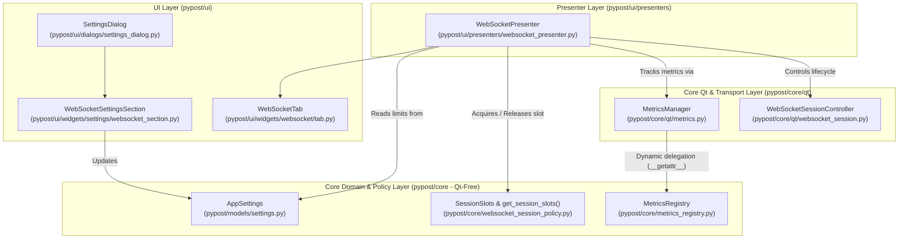
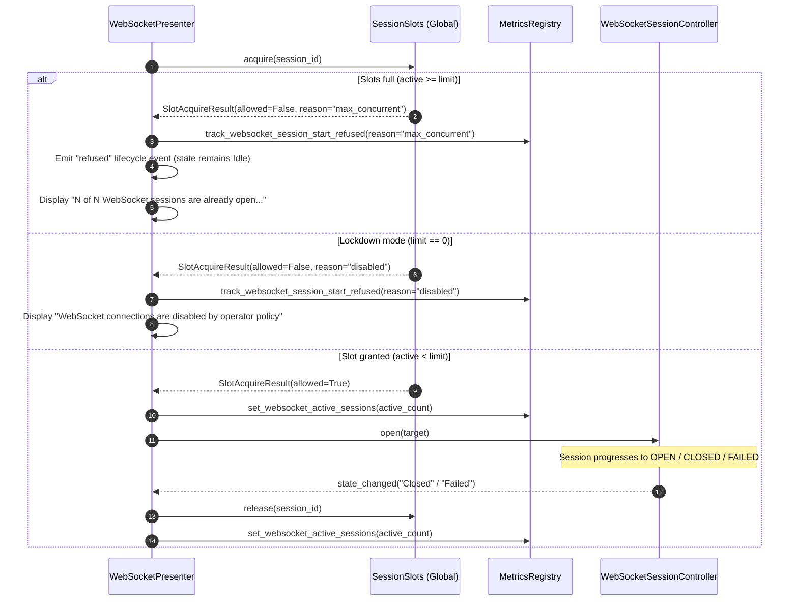

# WebSocket Settings, Session Ceiling, Metrics, and Logging (PYPOST-1136)

## Overview

The WebSocket Settings, Session Ceiling, Metrics, and Logging subsystem (**WS-10**,
Epic PYPOST-1123, task PYPOST-1136) provides enterprise-grade operational controls, process-wide
concurrency ceilings, real-time Prometheus observability, and zero-leak structured logging across
all WebSocket connections in PyPost.

### Key Capabilities

- **Configurable Global Bounds**: Centralized runtime configuration in
  [`AppSettings`](file:///home/src/pypost/models/settings.py) covering stream capacities
  (`ws_max_stream_entries`), memory budgets (`ws_session_memory_budget_bytes`),
  incoming message limits (`ws_max_incoming_message_bytes`), UI truncation thresholds
  (`ws_display_truncate_bytes`), default heartbeat/reconnect policies, MCP probe limits,
  and concurrent session ceilings.
- **Process-Wide Concurrent Session Ceiling (D-14)**: Thread-safe, atomic slot coordination
  via [`SessionSlots`](file:///home/src/pypost/core/websocket_session_policy.py) shared between
  interactive GUI tabs and background MCP probe threads. When the ceiling is reached,
  connection attempts are deterministically refused with user guidance and metric tracking.
- **Lockdown Mode**: Setting `ws_max_concurrent_sessions = 0` immediately blocks all connection
  attempts across the application with an explicit operator-policy explanation.
- **Immediate Runtime Reconfiguration**: Changes saved in the Settings dialog take effect
  immediately for subsequent connection attempts without requiring an application restart.
- **Low-Cardinality Prometheus Observability**: 9 standardized Prometheus metrics tracking
  session lifecycles, active connection gauge, message/byte volume, buffer drop events,
  reconnect attempts, refusal counts, and MCP probe durations under `/metrics`.
- **Zero-Leak Structured Logging**: Key=value structured event logs following project conventions
  with strict redaction guarantees: message payloads, authorization headers, raw query tokens,
  and plaintext secrets are never written to logs at any level.

---

## Architecture & Component Design

### Component Diagram



### Module Responsibilities

```text
- pypost/models/settings.py (AppSettings):
  Pydantic v2 domain model defining ws_* global configuration fields and defaults.
- pypost/core/websocket_session_policy.py (SessionSlots, SlotAcquireResult):
  Thread-safe concurrency ceiling coordinator managing active session registration,
  atomic slot acquisition, idempotent release, and lockdown checks.
- pypost/core/metrics_registry.py (MetricsRegistry):
  Core Prometheus registry hosting 9 WebSocket counters, gauge, and histogram
  instruments with low-cardinality label normalization.
- pypost/core/qt/metrics.py (MetricsManager):
  Qt-friendly metrics adapter utilizing dynamic __getattr__ delegation to route calls
  to MetricsRegistry within strict line caps.
- pypost/ui/widgets/settings/websocket_section.py (WebSocketSettingsSection):
  Modular Settings dialog section rendering spinbox controls for WebSocket bounds,
  session ceilings, and probe limits.
- pypost/ui/presenters/websocket_presenter.py (WebSocketPresenter):
  Orchestrates connection attempts against SessionSlots, handles refusal lifecycle events,
  applies display truncation, and emits structured zero-leak log events.
```

---

## Global Configuration Schema

All WebSocket settings are declared on `AppSettings` with safe, production-ready defaults:

| Field Name | Type | Default | Description |
|---|---|---|---|
| `ws_max_concurrent_sessions` | `int` | `8` | Ceiling on concurrent sessions (`0` = lockdown). |
| `ws_max_stream_entries` | `int` | `5,000` | Max entries in stream buffer before trimming. |
| `ws_session_memory_budget_bytes` | `int` | `67,108,864` (64 MiB) | Max memory per session stream buffer. |
| `ws_max_incoming_message_bytes` | `int` | `8,388,608` (8 MiB) | Max incoming frame size (exceeding closes 1009). |
| `ws_display_truncate_bytes` | `int` | `262,144` (256 KiB) | Inspector inline preview truncation threshold. |
| `ws_mcp_probe_max_messages` | `int` | `10` | Default capture message count for MCP probes. |
| `ws_mcp_probe_max_duration_ms` | `int` | `10,000` (10s) | Default timeout in ms for MCP probes. |
| `ws_default_heartbeat` | `HeartbeatPolicy` | Enabled (30s / 10s) | Default ping interval and timeout policy. |
| `ws_default_reconnect` | `ReconnectPolicy` | Enabled (5 attempts) | Default exponential backoff reconnect policy. |

---

## Concurrency Control & Session Slots (D-14)

### `SessionSlots` Architecture

The `SessionSlots` class in `pypost/core/websocket_session_policy.py` is a thread-safe,
Qt-free coordinator. It synchronizes interactive GUI connection attempts (running on the Qt main
thread) and MCP probe workers (running concurrently on background worker threads).

```python
@dataclass(frozen=True)
class SlotAcquireResult:
    allowed: bool
    reason: Optional[str] = None  # "max_concurrent" | "disabled" | None
    active_count: int = 0
    limit: int = 8

class SessionSlots:
    def acquire(self, session_id: str) -> SlotAcquireResult: ...
    def release(self, session_id: str) -> bool: ...
    def set_max_slots(self, limit: int) -> None: ...
    def is_holding_slot(self, session_id: str) -> bool: ...
    def reset(self) -> None: ...
```

### Concurrency Sequence Flow



### Invariants

1. **Atomic Acquisition**: Slot checks and additions are protected by `threading.Lock`.
2. **Idempotent Release**: Calling `release(session_id)` multiple times or for an unknown ID
   is safe and will never decrement counters below zero or raise an exception.
3. **Guaranteed Release on All Exits**: Slots are released on user disconnect, peer close,
   transport handshake errors, TLS rejection, heartbeat timeouts, and presenter teardown.

---

## Prometheus Observability

All 9 WebSocket metrics are registered in `pypost/core/metrics_registry.py` and exposed via
the Prometheus HTTP endpoint (`http://127.0.0.1:9080/metrics`) and the MCP `metrics://all` resource.

### Metrics Reference Table

| Metric Name | Type | Labels | Description |
|---|---|---|---|
| `websocket_sessions_opened_total` | Counter | `outcome` | Opened WebSocket sessions (`success`, `failure`, `timeout`, `tls_rejected`). |
| `websocket_sessions_closed_total` | Counter | `reason` | Closed sessions (`clean`, `peer_close`, `heartbeat_timeout`, `transport_error`, `reconnect_exhausted`, `forced`). |
| `websocket_messages_total` | Counter | `direction`, `kind` | Transferred messages (`direction`: `inbound`/`outbound`; `kind`: `text`/`binary`/`ping`/`pong`). |
| `websocket_message_bytes_total` | Counter | `direction` | Payload volume in bytes transferred (`direction`: `inbound`, `outbound`). |
| `websocket_stream_entries_dropped_total` | Counter | `reason` | Dropped stream entries due to limits (`reason`: `capacity`, `memory_budget`). |
| `websocket_reconnect_attempts_total` | Counter | `outcome` | Reconnection attempts (`outcome`: `scheduled`, `succeeded`, `exhausted`). |
| `websocket_active_sessions` | Gauge | None | Instantaneous number of active concurrent WebSocket sessions holding slots. |
| `websocket_session_start_refused_total` | Counter | `reason` | Session start attempts refused by concurrency policy (`max_concurrent`, `disabled`). |
| `websocket_probe_duration_seconds` | Histogram | `outcome` | Probe execution wall time in seconds (`success`, `timeout`, `limit_reached`, `error`). |

### Dynamic Delegation Pattern

To comply with the strict LOC limit (185 lines) on
[`pypost/core/qt/metrics.py`](file:///home/src/pypost/core/qt/metrics.py),
`MetricsManager` delegates metric calls dynamically to its backing `MetricsRegistry`:

```python
def __getattr__(self, name: str) -> Any:
    if self._registry is not None and hasattr(self._registry, name):
        return getattr(self._registry, name)
    raise AttributeError(f"'{type(self).__name__}' object has no attribute '{name}'")
```

---

## Zero-Leak Structured Logging

Log events follow the key=value structured formatting convention detailed in
[`doc/dev/logging.md`](file:///home/src/doc/dev/logging.md).

### Domain Event Catalog

| Event Name | Level | Key Fields | Description |
|---|---|---|---|
| `websocket_connect_initiated` | INFO | `session_id`, `profile_id`, `url_masked`, `subprotocols` | Connection attempt initiated. |
| `websocket_disconnect_initiated` | INFO | `session_id` | User requests manual disconnection. |
| `websocket_connected` | INFO | `session_id`, `subprotocol`, `handshake_ms` | Handshake completes successfully. |
| `websocket_closed` | INFO | `session_id`, `close_code`, `peer_initiated`, `duration_s` | Connection closes cleanly or by peer. |
| `websocket_session_refused` | WARNING | `profile_id`, `reason`, `active`, `limit` | Slot limit reached or lockdown active. |
| `websocket_handshake_failed` | ERROR | `session_id`, `category`, `detail_len` | HTTP or network handshake error. |
| `websocket_presenter_teardown` | INFO | `session_id` | Tab closed / presenter destroyed. |
| `websocket_send_blocked_not_open` | WARNING | `state` | User or sequence tries to send when closed. |
| `websocket_sending_message` | DEBUG | `length` | Outbound message sent (payload excluded). |

### Redaction & Sanitization Guarantees

1. **Payload Redaction**: Raw text, binary, hex, JSON, and ping/pong payloads are **never** logged.
2. **URL Token Sanitization**: Target URLs are passed through
   `sanitize_text(url, env_vars, hidden_keys)` before logging to mask bearer tokens and passwords.
3. **Header Privacy**: Authorization, cookie, and custom handshake headers are never emitted.

---

## Settings UI Integration

The `WebSocketSettingsSection` widget
([`pypost/ui/widgets/settings/websocket_section.py`](file:///home/src/pypost/ui/widgets/settings/websocket_section.py))
is integrated into the central `SettingsDialog`.

### UI Controls

- **Max Concurrent Sessions**: Spinbox (`0` to `100`). Setting to `0` displays `0 (disabled)`.
- **Max Stream Entries**: Spinbox (`100` to `1,000,000`).
- **Session Memory Budget (bytes)**: Spinbox (`1 MiB` to `2 GiB`, step: `1 MiB`).
- **Max Incoming Message Size (bytes)**: Spinbox (`1 KiB` to `2 GiB`, step: `1 MiB`).
- **Display Truncate Threshold (bytes)**: Spinbox (`1 KiB` to `2 GiB`, step: `1 KiB`).
- **MCP Probe Max Messages**: Spinbox (`1` to `1,000`).
- **MCP Probe Max Duration (ms)**: Spinbox (`100` to `600,000`, step: `1000`).

---

## Testing & Verification

Automated test suites verify all functionality without requiring a display server:

```bash
# Run WebSocket settings, limits, and concurrency tests
pytest tests/test_websocket_settings_and_limits_repro.py -v

# Run all WebSocket test suites
pytest tests/test_websocket*.py -v

# Verify Prometheus metrics registration and scrape
pytest tests/test_metrics_websocket.py -v

# Verify zero-leak logging contracts
pytest tests/test_websocket_logging_security.py -v
```

---

## Troubleshooting

### Connection Immediately Refused: "8 of 8 WebSocket sessions are already open"

- **Cause**: The process-wide concurrent session limit (`ws_max_concurrent_sessions`) is reached.
- **Remedy**: Disconnect idle tabs or increase the concurrency ceiling in Settings.

### Connection Refused: "WebSocket connections are disabled by operator policy"

- **Cause**: `ws_max_concurrent_sessions` is set to `0` (lockdown mode).
- **Remedy**: Set `ws_max_concurrent_sessions` to a value greater than `0` in Settings.

### Stream Frames Missing / Dropped

- **Cause**: Buffer reached `ws_max_stream_entries` or `ws_session_memory_budget_bytes`.
- **Remedy**: Increase stream capacity or memory budget in Settings.
