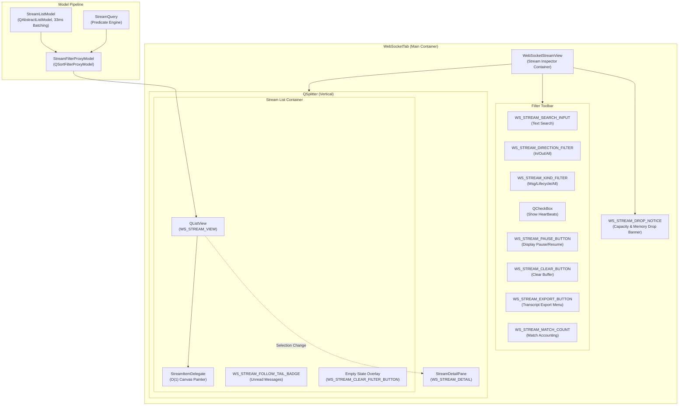
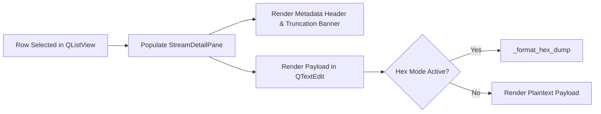

# WebSocket Stream Inspector and Virtualized Live Stream Viewer (PYPOST-1133)

## Overview

The WebSocket Stream Inspector (**WS-5**, Epic PYPOST-1123, task PYPOST-1133) is a high-performance, virtualized real-time message stream inspection interface embedded in PyPost's `WebSocketTab`. It provides developers and automated agents with deep observability into bidirectional WebSocket traffic, frame lifecycles, wire-level representations, and session telemetry.

### Key Capabilities

- **Virtualized Canvas Rendering**: Zero per-row `QWidget` allocations using `QStyledItemDelegate` and `uniformItemSizes=True` for smooth $O(1)$ 60 FPS scrolling over 10,000+ retained frames.
- **Multi-Dimensional Filtering**: Real-time filtering by transmission direction (`in` / `out`), entry kind (`message` / `lifecycle`), text search queries, and routine heartbeat ping/pong suppression.
- **Honest Display Pause & Follow-Tail Tracking**: Independent display pause that maintains background network intake, auto-scroll tail snapping, and floating unread message counter badges.
- **Buffer Drop Accounting**: Prominent drop notice banners displaying dropped frame counts attributed to ring buffer capacity limits or memory budget constraints.
- **Deep Single-Entry Inspection**: Dedicated detail pane with metadata header, display truncation warnings, word wrap toggle, 16-byte hex dump formatting, masked clipboard copy, and environment variable capture.
- **Dual-Format Transcript Export**: Structured JSON transcript and human-readable plain text export with drop statistics and atomic disk writes.
- **Stable Automation Identities**: Deterministic `WS_STREAM_*` widget identifiers registered in `KEY_WIDGET_IDS` for automated agent driving.

---

## Architecture & Component Design

### Component Hierarchy



### Module Responsibilities

| Component | Location | Responsibilities |
|---|---|---|
| `WebSocketStreamView` | `pypost/ui/widgets/websocket/stream_view.py` | Root container widget hosting the filter toolbar, drop notice banner, list view container, follow-tail badge, empty state overlay, and vertical splitter with `StreamDetailPane`. |
| `StreamFilterProxyModel` | `pypost/ui/widgets/websocket/stream_view.py` | `QSortFilterProxyModel` subclass evaluating incoming rows against a `StreamQuery` predicate for direction, kind, search substring, and heartbeat suppression. |
| `StreamItemDelegate` | `pypost/ui/widgets/websocket/stream_view.py` | Custom `QStyledItemDelegate` rendering timestamps, direction glyphs, wire sizes, and elided payload snippets directly onto the canvas in $O(1)$ time. |
| `StreamDetailPane` | `pypost/ui/widgets/websocket/stream_view.py` | Bottom inspection pane displaying entry metadata, truncation banner, payload viewer, wrap/hex toggles, clipboard copy, and environment variable capture. |
| `_format_hex_dump` | `pypost/ui/widgets/websocket/stream_view.py` | Formats arbitrary string or binary payloads into standard 16-byte hexadecimal dump lines with offset, hex bytes, and ASCII representation. |
| `websocket_stream_export` | `pypost/core/websocket_stream_export.py` | Core serialization routines for JSON and Plain Text transcripts with atomic file persistence. |

---

## Virtualized Rendering Model

Rendering thousands of live messages in Qt without UI stutter requires strict avoidance of per-row widget allocations:

1. **Zero `QWidget` Allocations**: The stream list uses a single `QListView` rather than a scrollable layout of individual message widgets.
2. **Uniform Item Sizing**: `setUniformItemSizes(True)` is enabled on `QListView`, allowing Qt to calculate scrollbar geometries and item layouts in $O(1)$ arithmetic without querying individual item heights.
3. **Fixed Row Geometry**: `StreamItemDelegate.sizeHint()` returns a constant height of 26 pixels.
4. **Canvas Painting (`StreamItemDelegate.paint`)**:
   - **Background**: Paints selection and hover highlights using palette colors.
   - **Timestamp**: Renders formatted UTC time (`HH:MM:SS.mmm`) in muted gray (`#808080`) at $x = 6\text{px}$, width $= 90\text{px}$.
   - **Direction & Kind Glyph**: Renders colored direction indicators at width $= 24\text{px}$:
     - `<-` (Blue `#2196F3`): Inbound messages.
     - `->` (Green `#4CAF50`): Outbound messages.
     - `(i)` (Purple `#AB47BC`): Lifecycle events (connecting, open, close, error).
     - `·` (Gray `#808080`): Routine heartbeats or other entries.
   - **Wire Size**: Right-aligned size string (e.g., `512 B`, `12.4 KB`, `1.5 MB`), annotated with `[TRUNC]` if truncated at ingest.
   - **Payload Snippet**: Fills remaining width using `QFontMetrics.elidedText()` with `Qt.TextElideMode.ElideRight`.

---

## Filtering, Search, Follow-Tail & Drop Accounting

### Multi-Dimensional Filtering

Filtering is handled via `StreamFilterProxyModel` backed by `StreamQuery`:

```python
class StreamFilterProxyModel(QSortFilterProxyModel):
    def filterAcceptsRow(self, source_row: int, source_parent: QModelIndex) -> bool:
        entry = self.sourceModel().get_entry(source_row)
        return self._query.matches(entry)
```

- **Direction Filter**: `set_direction_filter("in" | "out" | None)` isolates inbound or outbound traffic.
- **Kind Filter**: `set_kind_filter("message" | "lifecycle" | None)` separates application data from protocol events.
- **Text Search**: `set_search_text(query)` performs case-insensitive substring matching against message payloads and lifecycle detail strings.
- **Heartbeat Suppression**: `set_show_heartbeats(False)` filters out routine heartbeat ping/pong messages to reduce visual noise.
- **Match Accounting**: The match count label (`WS_STREAM_MATCH_COUNT`) reports visible matches vs hidden entries (e.g., `4 matches (12 hidden)` or `16 entries`).
- **Empty Filter State Overlay**: When active filters hide all messages, an overlay informs the user and displays a `"Clear filter"` button (`WS_STREAM_CLEAR_FILTER_BUTTON`).

### Display Pause & Follow-Tail Mechanics

- **Auto-Scrolling**: When attached to the bottom, new messages inserted from the 33ms batch queue automatically scroll the view to the latest entry.
- **Scroll Detachment**: Manually scrolling up detaches from the tail, preserving the user's reading position.
- **Display Pause**: Clicking `"Pause"` (`WS_STREAM_PAUSE_BUTTON`) sets `is_paused = True`. Incoming network frames continue to be ingested and appended to the underlying model in the background without moving the viewport.
- **Floating Follow-Tail Badge**: When detached or paused, incoming messages increment `_unread_count` and display a floating badge (`WS_STREAM_FOLLOW_TAIL_BADGE`, e.g., `"↓ 5 new messages"`). Clicking the badge clears the counter, unpauses display tracking, and snaps the viewport to the bottom.

### Buffer Drop Accounting

The `MessageStream` ring buffer evicts oldest messages when capacity (e.g. 10,000 entries) or memory limits are exceeded.

- When `stream.dropped["capacity"] > 0` or `stream.dropped["memory_budget"] > 0`, `WS_STREAM_DROP_NOTICE` becomes visible:
  `(!) 250 messages dropped (200 capacity, 50 memory_budget)`
- Clearing the stream view resets the model buffer and drop counters.

---

## Detail Inspection & Variable Capture

Selecting an entry in `QListView` populates the embedded `StreamDetailPane` (`WS_STREAM_DETAIL`):



### Detail Pane Features

1. **Metadata Header**: Displays direction icon, payload format, wire byte size, and full ISO UTC timestamp (e.g., `<- inbound · json · 1.2 KB · 2026-08-22T12:00:00.000Z`).
2. **Truncation Banner**: When `entry.truncated` is `True`, an orange warning banner alerts the user: `(!) Display truncated (wire size: 2.5 MB)`.
3. **Copy Action** (`WS_STREAM_DETAIL_COPY_BUTTON`): Copies the currently selected editor substring or full message payload to the clipboard (preserving in-memory secret masking).
4. **Set as Variable...** (`WS_STREAM_DETAIL_SET_VAR_BUTTON`): Prompts the user with `QInputDialog.getText` to capture the selected text (or full payload) into an environment variable, emitting `variable_capture_requested(name, value)`.
5. **Word Wrap Toggle** (`WS_STREAM_DETAIL_WRAP_BUTTON`): Toggles `QTextEdit.LineWrapMode` between `WidgetWidth` and `NoWrap`.
6. **Hex Dump Toggle** (`WS_STREAM_DETAIL_HEX_BUTTON`): Formats the payload into standard 16-byte hex dump columns:

```text
00000000: 7b 22 74 79 70 65 22 3a  22 74 69 63 6b 65 72 22  |{"type":"ticker"|
00000010: 2c 22 70 72 69 63 65 22  3a 32 35 30 30 2e 35 7d  |,"price":2500.5}|
```

---

## Transcript Export Formats

The Export button (`WS_STREAM_EXPORT_BUTTON`) opens a context menu allowing export to JSON or Plain Text transcripts via `pypost.core.websocket_stream_export`.

### JSON Transcript (`export_stream_to_json_file`)

```json
{
  "schema_version": "1.0",
  "metadata": {
    "exported_at": "2026-08-22T12:00:00.000Z",
    "total_retained": 2,
    "dropped": {
      "capacity": 0,
      "memory_budget": 0
    }
  },
  "entries": [
    {
      "seq": 1,
      "ts_utc": "2026-08-22T12:00:00.000Z",
      "kind": "lifecycle",
      "direction": "in",
      "payload_format": "text",
      "payload": "connected",
      "byte_size": 9,
      "truncated": false,
      "detail": "Connection established with subprotocol json.v2"
    },
    {
      "seq": 2,
      "ts_utc": "2026-08-22T12:00:01.000Z",
      "kind": "message",
      "direction": "in",
      "payload_format": "json",
      "payload": "{\"price\": 2500.5}",
      "byte_size": 17,
      "truncated": false,
      "detail": ""
    }
  ]
}
```

### Plain Text Transcript (`export_stream_to_text_file`)

```text
# PyPost WebSocket Transcript
# Exported: 2026-08-22T12:00:00.000Z
# Retained entries: 2
# Dropped entries: capacity=0, memory_budget=0
# ----------------------------------------------------------------------
[2026-08-22T12:00:00.000Z] [in] [9B] [lifecycle] Connection established with subprotocol json.v2
[2026-08-22T12:00:01.000Z] [in] [17B] {"price": 2500.5}
```

---

## Stable UI Identities (`widget_ids.py`)

All interactive elements expose deterministic `objectName` identifiers and accessible identifiers:

| Constant | ID Value | Description |
|---|---|---|
| `WS_STREAM_VIEW` | `pypost_ws_stream_view` | Main `QListView` and root `WebSocketStreamView` container |
| `WS_STREAM_SEARCH_INPUT` | `pypost_ws_stream_search_input` | Filter search text `QLineEdit` |
| `WS_STREAM_DIRECTION_FILTER` | `pypost_ws_stream_direction_filter` | Direction filter `QComboBox` (`All`, `Inbound`, `Outbound`) |
| `WS_STREAM_KIND_FILTER` | `pypost_ws_stream_kind_filter` | Kind filter `QComboBox` (`All`, `Messages`, `Lifecycle`) |
| `WS_STREAM_PAUSE_BUTTON` | `pypost_ws_stream_pause_button` | Pause / Resume display tracking `QPushButton` |
| `WS_STREAM_CLEAR_BUTTON` | `pypost_ws_stream_clear_button` | Stream buffer clear `QPushButton` |
| `WS_STREAM_EXPORT_BUTTON` | `pypost_ws_stream_export_button` | Transcript export menu `QPushButton` |
| `WS_STREAM_MATCH_COUNT` | `pypost_ws_stream_match_count` | Visible match and hidden entry counter `QLabel` |
| `WS_STREAM_CLEAR_FILTER_BUTTON` | `pypost_ws_stream_clear_filter_button` | Empty filter state reset `QPushButton` |
| `WS_STREAM_FOLLOW_TAIL_BADGE` | `pypost_ws_stream_follow_tail_badge` | Unread messages badge `QPushButton` |
| `WS_STREAM_DROP_NOTICE` | `pypost_ws_stream_drop_notice` | Capacity and memory drop warning `QWidget` banner |
| `WS_STREAM_DETAIL` | `pypost_ws_stream_detail` | Single entry inspection `StreamDetailPane` |
| `WS_STREAM_DETAIL_COPY_BUTTON` | `pypost_ws_stream_detail_copy_button` | Detail payload clipboard copy `QPushButton` |
| `WS_STREAM_DETAIL_SET_VAR_BUTTON` | `pypost_ws_stream_detail_set_var_button` | Detail environment variable capture `QPushButton` |
| `WS_STREAM_DETAIL_WRAP_BUTTON` | `pypost_ws_stream_detail_wrap_button` | Detail word-wrap toggle `QPushButton` |
| `WS_STREAM_DETAIL_HEX_BUTTON` | `pypost_ws_stream_detail_hex_button` | Detail hexadecimal dump toggle `QPushButton` |

---

## Testing Strategy & Test Suites

| Test Suite | Purpose | Execution |
|---|---|---|
| `tests/test_websocket_stream_view_repro.py` | 17 focused unit and integration tests covering automation IDs, `StreamFilterProxyModel` query filtering, `StreamItemDelegate` canvas painting, `WebSocketStreamView` controls, follow-tail/pause mechanics, drop banners, `StreamDetailPane` wrap/hex/copy/var-capture, and transcript export writers. | `.venv/bin/pytest tests/test_websocket_stream_view_repro.py` |
| `tests/test_ui_identity_spotcheck.py` | Automation ID verification across widget hierarchies and themes for all `WS_STREAM_*` keys. | `.venv/bin/pytest tests/test_ui_identity_spotcheck.py` |
| `tests/test_websocket_stream_and_codecs.py` | Validates transcript formatting schema, metadata blocks, and atomic file serialization. | `.venv/bin/pytest tests/test_websocket_stream_and_codecs.py` |
