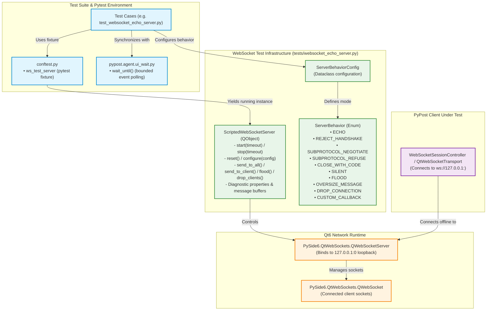

# Scripted WebSocket Test Server and Fixture

## Overview

PyPost provides an in-process, offline, headless, non-blocking WebSocket loopback test server (**WS-11**, Epic PYPOST-1123) for testing WebSocket client capabilities without external network dependencies.

Delivered as the foundational Wave 0 prerequisite of Epic PYPOST-1123, this test harness enables all subsequent WebSocket implementation stories (WS-1 session engine, WS-2 persistence, WS-3 ring buffer, WS-4 tab, WS-5 stream inspector, WS-6 composer, WS-7 masking, WS-9 MCP probe, WS-10 metrics) to run isolated, deterministic, 100% offline automated test suites in CI and local environments.

Key architectural characteristics include:
- **100% Offline & In-Process**: Runs entirely within the local test process on loopback address `127.0.0.1`, eliminating flaky external network requests, public rate limits, and third-party service outages.
- **Dynamic Ephemeral Port Allocation**: Binds dynamically to `127.0.0.1:0` where the OS assigns an available ephemeral port, preventing port collisions during concurrent test execution.
- **Scripted Protocol & Failure Scenarios**: Supports 10 distinct scripted server behaviors (echo, handshake rejection, subprotocol negotiation/refusal, custom RFC 6455 close codes, silence/heartbeat suppression, message flood generation, oversize frames, abrupt TCP drops, and custom response callbacks).
- **Headless Qt Offscreen Execution**: Fully operational in headless environments (`QT_QPA_PLATFORM=offscreen`) without a physical display.
- **Bounded Synchronization**: Integrates with [`pypost.agent.ui_wait.wait_until`](file:///home/src/pypost/agent/ui_wait.py) for deterministic condition polling rather than arbitrary `time.sleep` delays.
- **Leak-Free Resource Teardown**: Guaranteed socket, port, and timer cleanup across repeated startup/teardown cycles.
- **Observable Inspection**: Exposes diagnostic properties, cumulative counters, ordered message buffers, and structured `key=value` debug logging.

---

## Architecture & Components

### System Component Diagram



---

## Module Breakdown

| Module / Component | Location | Primary Responsibilities |
|---|---|---|
| [`ScriptedWebSocketServer`](file:///home/src/tests/websocket_echo_server.py#L61) | `tests/websocket_echo_server.py` | Headless `QObject` managing the loopback `QWebSocketServer`, client socket tracking, message buffering, scripted behavior dispatch, flood emission, and bounded startup/teardown. |
| [`ServerBehavior`](file:///home/src/tests/websocket_echo_server.py#L28) | `tests/websocket_echo_server.py` | Enum declaring all supported scripted server behaviors (`ECHO`, `REJECT_HANDSHAKE`, `SUBPROTOCOL_NEGOTIATE`, `SUBPROTOCOL_REFUSE`, `CLOSE_WITH_CODE`, `SILENT`, `FLOOD`, `OVERSIZE_MESSAGE`, `DROP_CONNECTION`, `CUSTOM_CALLBACK`). |
| [`ServerBehaviorConfig`](file:///home/src/tests/websocket_echo_server.py#L44) | `tests/websocket_echo_server.py` | Dataclass configuring behavior parameters (close codes, reason strings, subprotocol lists, flood counts, oversize bytes, custom callback hooks). |
| [`ws_test_server`](file:///home/src/tests/conftest.py#L51) | `tests/conftest.py` | Function-scoped pytest fixture that automatically instantiates, starts, yields, and stops a clean `ScriptedWebSocketServer` instance for each test. |
| [`test_websocket_echo_server.py`](file:///home/src/tests/test_websocket_echo_server.py) | `tests/test_websocket_echo_server.py` | Complete test suite verifying all 10 behaviors, lifecycle management, context managers, leak-free cycles, per-client selective delivery, disconnect cleanup, responsiveness under load, and observability. |

---

## Scripted Server Behaviors Matrix

[`ScriptedWebSocketServer`](file:///home/src/tests/websocket_echo_server.py) supports 10 distinct behavior modes configured via [`ServerBehaviorConfig`](file:///home/src/tests/websocket_echo_server.py):

| Behavior (`ServerBehavior`) | Trigger / Mechanism | Config Options | Description & Use Case |
|---|---|---|---|
| `ECHO` | Incoming text or binary message | *(Default behavior)* | Echoes received text frames back as text and binary frames back as binary. Standard verification of bidirectional communication. |
| `REJECT_HANDSHAKE` | `originAuthenticationRequired` Qt signal | N/A | Sets `authenticator.setAllowed(False)` during HTTP Upgrade handshake, causing connection rejection (HTTP 403). Tests client handshake error handling. |
| `SUBPROTOCOL_NEGOTIATE` | `newConnection` with subprotocol match | `supported_subprotocols: list[str]` | Configures `QWebSocketServer.setSupportedSubprotocols(...)` to agree on requested subprotocol. Tests client subprotocol negotiation. |
| `SUBPROTOCOL_REFUSE` | `newConnection` with subprotocol request | N/A | Clears supported subprotocols on server (`[]`). Tests client subprotocol refusal handling and fallback. |
| `CLOSE_WITH_CODE` | On connection or after N received messages | `close_code: int`<br/>`close_reason: str`<br/>`close_on_connect: bool`<br/>`close_on_message_count: Optional[int]` | Sends RFC 6455 Close frame with custom code (e.g. 1000, 1001, 1008, 1011) and custom reason string. Tests graceful and abnormal close handling. |
| `SILENT` | Message / Ping arrival | N/A | Suppresses all responses (does not echo messages or reply to pings). Tests client heartbeat ping timeout detection and auto-recovery. |
| `FLOOD` | Manual call or script trigger via `.flood()` | `flood_count: int`<br/>`flood_message_size: int` | Emits a high-frequency burst of messages to stress test client ingestion pipelines, message ring buffers, and UI responsiveness. |
| `OVERSIZE_MESSAGE` | Test-initiated delivery via `.send_to_all()` | `oversize_bytes: int` (default 10 MB) | Delivers a message frame exceeding standard limits to verify client truncation, rejection safeguards, and memory caps. |
| `DROP_CONNECTION` | On connect or midstream via `.drop_clients()` | N/A | Abruptly calls `client.abort()` on underlying TCP sockets without sending a WebSocket Close frame. Tests abnormal disconnection (code 1006) and auto-reconnect backoff. |
| `CUSTOM_CALLBACK` | Incoming message event | `custom_callback: Callable[[server, client, msg], None]` | Invokes a custom user-defined callback for dynamic multi-step protocol simulations and interactive response logic. |

---

## API & Usage Examples

### 1. Using the `ws_test_server` Pytest Fixture

The most common way to test WebSocket features is using the `ws_test_server` fixture in `tests/conftest.py`:

```python
import pytest
from PySide6.QtWebSockets import QWebSocket
from pypost.agent.ui_wait import wait_until

@pytest.mark.timeout(10)
def test_websocket_echo_roundtrip(ws_test_server, qapp):
    # Server is already running on an ephemeral loopback port
    server_url = ws_test_server.url  # e.g., "ws://127.0.0.1:42135"

    received_echoes = []
    client = QWebSocket()
    client.textMessageReceived.connect(received_echoes.append)
    client.open(server_url)

    # Bounded wait until client is connected
    wait_until(
        lambda: client.isValid(),
        timeout=3.0,
        message="Client failed to connect",
    )

    # Send text message
    client.sendTextMessage("Hello PyPost")

    # Bounded wait until echo received
    wait_until(
        lambda: len(received_echoes) == 1,
        timeout=3.0,
        message="Did not receive echoed message",
    )

    assert received_echoes[0] == "Hello PyPost"
    assert ws_test_server.received_text_messages == ["Hello PyPost"]

    client.close()
```

### 2. Context Manager Usage

[`ScriptedWebSocketServer`](file:///home/src/tests/websocket_echo_server.py) can also be used as a standard Python context manager:

```python
from tests.websocket_echo_server import ScriptedWebSocketServer

def test_standalone_server(qapp):
    with ScriptedWebSocketServer("CustomServer") as server:
        assert server.is_listening is True
        assert server.host == "127.0.0.1"
        assert server.port > 0
        assert server.url.startswith("ws://127.0.0.1:")
    
    # Server is automatically stopped upon exiting the context block
    assert server.is_listening is False
```

### 3. Simulating Handshake Rejection

```python
from tests.websocket_echo_server import ServerBehavior, ServerBehaviorConfig

@pytest.mark.timeout(10)
def test_handshake_rejection(ws_test_server, qapp):
    # Configure server to reject incoming handshakes
    ws_test_server.configure(
        ServerBehaviorConfig(behavior=ServerBehavior.REJECT_HANDSHAKE)
    )

    client = QWebSocket()
    client_errors = []
    client.errorOccurred.connect(client_errors.append)
    client.open(ws_test_server.url)

    # Bounded wait until rejection error occurs
    wait_until(
        lambda: len(client_errors) > 0,
        timeout=3.0,
        message="Handshake rejection not detected",
    )

    assert not client.isValid()
    client.close()
```

### 4. Subprotocol Negotiation and Refusal

```python
from tests.websocket_echo_server import ServerBehavior, ServerBehaviorConfig

@pytest.mark.timeout(10)
def test_subprotocol_negotiation(ws_test_server, qapp):
    # Configure server to accept 'v1.stream' subprotocol
    ws_test_server.configure(
        ServerBehaviorConfig(
            behavior=ServerBehavior.SUBPROTOCOL_NEGOTIATE,
            supported_subprotocols=["v1.stream", "v2.stream"],
        )
    )

    from PySide6.QtNetwork import QNetworkRequest
    from PySide6.QtWebSockets import QWebSocketHandshakeOptions

    options = QWebSocketHandshakeOptions()
    options.setSubprotocols(["v1.stream"])

    client = QWebSocket()
    client.open(QNetworkRequest(ws_test_server.url), options)

    wait_until(
        lambda: client.isValid(),
        timeout=3.0,
        message="Client failed to connect",
    )

    assert client.subprotocol() == "v1.stream"
    client.close()
```

### 5. Custom RFC 6455 Close Codes and Reasons

```python
from tests.websocket_echo_server import ServerBehavior, ServerBehaviorConfig

@pytest.mark.timeout(10)
def test_server_custom_close(ws_test_server, qapp):
    # Configure server to close immediately with code 1008 (Policy Violation)
    ws_test_server.configure(
        ServerBehaviorConfig(
            behavior=ServerBehavior.CLOSE_WITH_CODE,
            close_code=1008,
            close_reason="Unauthorized stream access",
            close_on_connect=True,
        )
    )

    closed_events = []
    client = QWebSocket()
    client.disconnected.connect(
        lambda: closed_events.append((client.closeCode().value, client.closeReason()))
    )
    client.open(ws_test_server.url)

    wait_until(
        lambda: len(closed_events) > 0,
        timeout=3.0,
        message="Client did not receive server closure",
    )

    code, reason = closed_events[0]
    assert code == 1008
    assert reason == "Unauthorized stream access"
```

### 6. Message Flood & Responsiveness Testing

```python
from tests.websocket_echo_server import ServerBehavior, ServerBehaviorConfig

@pytest.mark.timeout(15)
def test_flood_throughput(ws_test_server, qapp):
    client = QWebSocket()
    received_count = [0]
    client.textMessageReceived.connect(
        lambda msg: received_count.__setitem__(0, received_count[0] + 1)
    )
    client.open(ws_test_server.url)

    wait_until(lambda: client.isValid(), timeout=3.0)

    # Emit a burst of 100 messages (1 KB each)
    ws_test_server.flood(count=100, size=1024)

    # Verify all 100 frames received deterministically
    wait_until(
        lambda: received_count[0] == 100,
        timeout=5.0,
        message=f"Expected 100 messages, received {received_count[0]}",
    )

    assert received_count[0] == 100
    client.close()
```

### 7. Simulating Abrupt TCP Connection Drop

```python
@pytest.mark.timeout(10)
def test_abrupt_network_drop(ws_test_server, qapp):
    client = QWebSocket()
    disconnected = [False]
    client.disconnected.connect(lambda: disconnected.__setitem__(0, True))
    client.open(ws_test_server.url)

    wait_until(lambda: client.isValid(), timeout=3.0)

    # Abruptly drop TCP sockets without close handshake
    ws_test_server.drop_clients()

    wait_until(
        lambda: disconnected[0] is True,
        timeout=3.0,
        message="Client did not detect dropped connection",
    )

    assert not client.isValid()
```

### 8. Dynamic Custom Callback

```python
from tests.websocket_echo_server import ServerBehavior, ServerBehaviorConfig

@pytest.mark.timeout(10)
def test_dynamic_custom_callback(ws_test_server, qapp):
    def on_message(server, client, message):
        if message == "ping":
            client.sendTextMessage("pong")
        elif message == "auth":
            client.sendTextMessage("auth_ok")

    ws_test_server.configure(
        ServerBehaviorConfig(
            behavior=ServerBehavior.CUSTOM_CALLBACK,
            custom_callback=on_message,
        )
    )

    client = QWebSocket()
    replies = []
    client.textMessageReceived.connect(replies.append)
    client.open(ws_test_server.url)

    wait_until(lambda: client.isValid(), timeout=3.0)

    client.sendTextMessage("auth")
    wait_until(lambda: "auth_ok" in replies, timeout=3.0)

    client.sendTextMessage("ping")
    wait_until(lambda: "pong" in replies, timeout=3.0)

    assert replies == ["auth_ok", "pong"]
    client.close()
```

### 9. Targeted Per-Client Message Delivery

Use `send_to_client(server_peer, message)` to deliver a text or binary frame to one connected peer without broadcasting. Pass the **server-side** peer handle from `server.clients` (not the test's outbound `QWebSocket`):

```python
from tests.websocket_echo_server import ServerBehavior, ServerBehaviorConfig

@pytest.mark.timeout(10)
def test_selective_peer_delivery(ws_test_server, qapp):
    ws_test_server.configure(
        ServerBehaviorConfig(behavior=ServerBehavior.SILENT)
    )

    client_a = QWebSocket()
    client_b = QWebSocket()
    received_a: list[str] = []
    received_b: list[str] = []
    client_a.textMessageReceived.connect(received_a.append)
    client_b.textMessageReceived.connect(received_b.append)

    client_a.open(ws_test_server.url)
    wait_until(lambda: len(ws_test_server.clients) == 1, timeout=3.0)

    client_b.open(ws_test_server.url)
    wait_until(lambda: len(ws_test_server.clients) == 2, timeout=3.0)

    # Target first server-side peer only
    ws_test_server.send_to_client(ws_test_server.clients[0], "peer-specific")
    wait_until(
        lambda: received_a == ["peer-specific"] and received_b == [],
        timeout=3.0,
        message="Only targeted peer should receive message",
    )

    assert ws_test_server.sent_text_messages == ["peer-specific"]
    client_a.close()
    client_b.close()
```

> **Note:** On disconnect, the harness removes the peer from `clients` and calls `deleteLater()` for prompt Qt object reclamation under connection churn.

---

## Observability & Diagnostic Properties

[`ScriptedWebSocketServer`](file:///home/src/tests/websocket_echo_server.py) provides comprehensive inspection hooks for tests and test assertions:

### State & Diagnostic Properties

| Property | Type | Description |
|---|---|---|
| `host` | `str` | Always `"127.0.0.1"` (loopback IP). |
| `port` | `int` | Bound ephemeral port allocated by the OS (raises `RuntimeError` if not listening). |
| `url` | `str` | Complete WebSocket URL string (`ws://127.0.0.1:<port>`). |
| `is_listening` | `bool` | `True` when underlying `QWebSocketServer` is actively listening. |
| `behavior` | `ServerBehavior` | Current active behavior mode. |
| `clients` / `connected_clients` | `list[QWebSocket]` | Snapshot list of all currently connected client socket instances. |
| `connection_count` | `int` | Total number of accepted client connections since startup or last `.reset()`. |
| `disconnection_count` | `int` | Total number of client disconnections since startup or last `.reset()`. |
| `received_messages` | `list[str \| bytes]` | Chronological buffer of all received text and binary message payloads. |
| `received_text_messages` | `list[str]` | Filtered chronological list of received text frames. |
| `received_binary_messages` | `list[bytes]` | Filtered chronological list of received binary frames. |
| `sent_messages` | `list[str \| bytes]` | Chronological buffer of all emitted text and binary message payloads. |
| `sent_text_messages` | `list[str]` | Filtered chronological list of emitted text frames. |
| `sent_binary_messages` | `list[bytes]` | Filtered chronological list of emitted binary frames. |

### Resetting Server State

Calling `server.reset()` clears all received/sent message buffers, resets connection counters to zero, and restores the default `ServerBehavior.ECHO` configuration:

```python
ws_test_server.reset()
assert ws_test_server.received_messages == []
assert ws_test_server.connection_count == 0
```

### Structured Debug Logging

The server emits structured `key=value` debug events via the standard logger `logging.getLogger("tests.websocket_echo_server")`:

- `ws_server_started`: `name=%s host=%s port=%d url=%s`
- `ws_server_stopped`: `name=%s`
- `ws_server_reset`: `name=%s`
- `ws_server_configured`: `name=%s behavior=%s`
- `ws_server_origin_auth_evaluated`: `name=%s allowed=%s behavior=%s`
- `ws_server_client_connected`: `name=%s client_count=%d total_connections=%d`
- `ws_server_client_disconnected`: `name=%s remaining_clients=%d total_disconnections=%d`
- `ws_server_text_message_received`: `name=%s length=%d total_received=%d`
- `ws_server_binary_message_received`: `name=%s length=%d total_received=%d`
- `ws_server_text_message_sent`: `name=%s length=%d total_sent=%d`
- `ws_server_binary_message_sent`: `name=%s length=%d total_sent=%d`
- `ws_server_targeted_message_sent`: `name=%s length=%d total_sent=%d`
- `ws_server_flood_emitted`: `name=%s count=%d size=%d`
- `ws_server_clients_dropped`: `name=%s count=%d`

> [!NOTE]
> Message payloads are recorded with `length=%d` in logs rather than raw content, protecting against CI log bloat during flood stress testing.

---

## Best Practices & Guidelines

1. **Always Use Bounded Waits**:
   - Never use `time.sleep(...)` in WebSocket tests.
   - Use `wait_until(condition_lambda, timeout=..., message=...)` to process Qt events and resolve immediately when assertions pass.
2. **Explicit Pytest Timeouts**:
   - Every test function must be decorated with `@pytest.mark.timeout(...)` (e.g. `@pytest.mark.timeout(10)`) per repository test guardrails.
3. **Headless Execution**:
   - Tests run automatically in headless mode with `os.environ["QT_QPA_PLATFORM"] = "offscreen"` (set in `tests/conftest.py`).
4. **Fixture Scoping**:
   - The `ws_test_server` fixture is function-scoped to guarantee complete isolation and zero socket leakage between tests.
5. **Fast vs Slow Marks**:
   - Keep standard protocol tests fast (<1s per test). If adding heavy load stress benchmarks that take >5s, mark them with `@pytest.mark.slow`.

---

## Troubleshooting Guide

| Symptom | Probable Cause | Diagnostic / Solution |
|---|---|---|
| `RuntimeError: Server is not listening` when accessing `server.port` or `server.url` | Server was not started or failed to bind to `127.0.0.1:0`. | Call `server.start()` or use the `ws_test_server` pytest fixture which handles startup automatically. Check if `server.is_listening` is `True`. |
| Client fails to connect (`isValid() == False`) and timeout expires in `wait_until()` | Active behavior is set to `REJECT_HANDSHAKE`, or Qt event loop is not being processed. | Ensure `wait_until()` is used (which processes Qt events). Check if `server.behavior` was left in `REJECT_HANDSHAKE` from a previous configuration; call `server.reset()` if necessary. |
| Subprotocol is empty string on client after connection | Server was not configured with `SUBPROTOCOL_NEGOTIATE` or requested subprotocol did not match `supported_subprotocols`. | Configure `ServerBehaviorConfig(behavior=ServerBehavior.SUBPROTOCOL_NEGOTIATE, supported_subprotocols=[...])` before client connects. |
| `ws_server_origin_auth_evaluated allowed=false` in logs | Handshake rejection behavior is active (`ServerBehavior.REJECT_HANDSHAKE`). | Expected when testing handshake error handling. For normal tests, configure behavior to `ServerBehavior.ECHO`. |
| High CPU or test timeout during flood tests | Flood count too high for single test timeout window. | Check `@pytest.mark.timeout(...)` on the test. For large bursts, ensure the timeout is at least 15 seconds or mark test with `@pytest.mark.slow`. |
| Port conflict or address already in use error | Hardcoded static port was attempted instead of dynamic port `0`. | Always bind with port `0` (`listen(QHostAddress.LocalHost, 0)`). `ScriptedWebSocketServer` binds to port `0` dynamically by default. |
