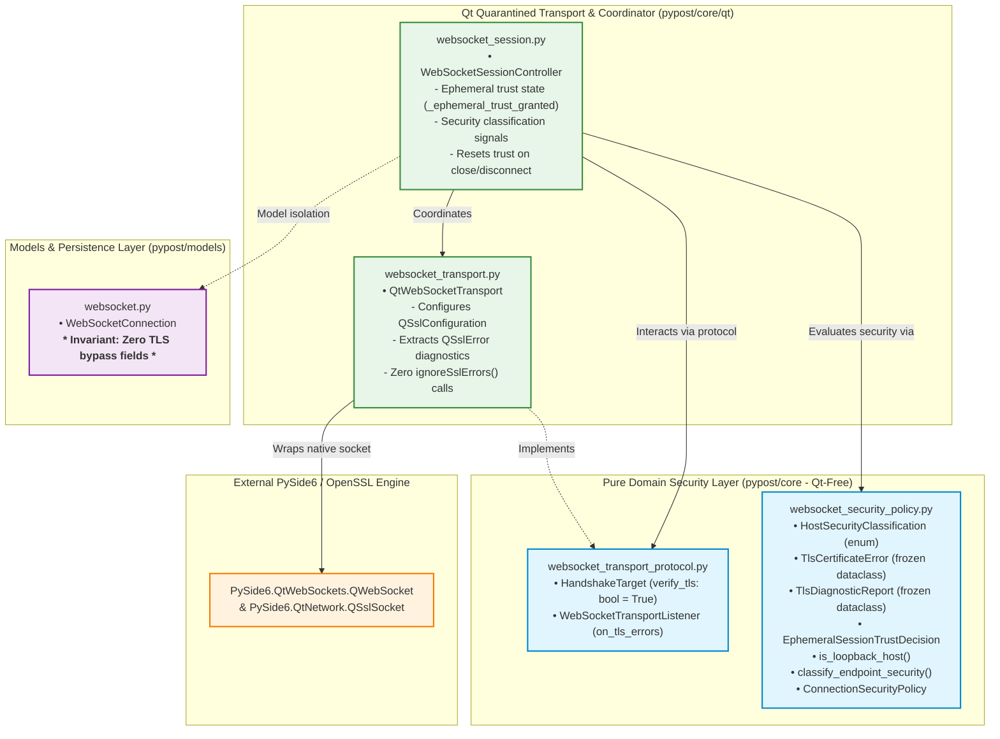
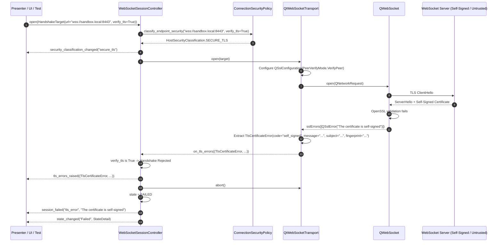
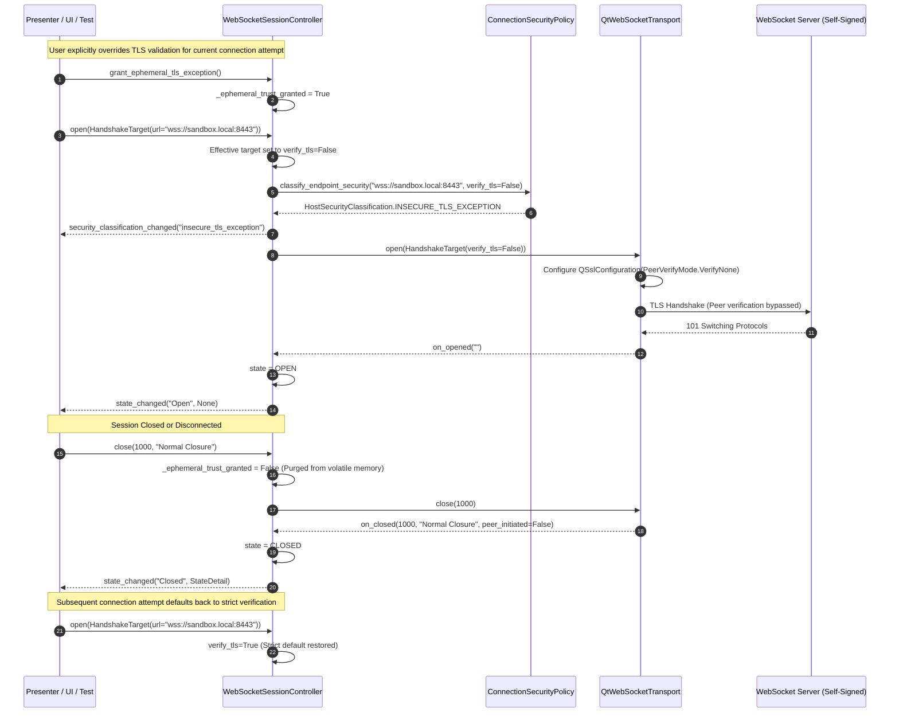

# WebSocket TLS and Connection-Security Policy

## Overview

PyPost enforces a strict, secure-by-default transport and certificate security policy for all WebSocket connections (**WS-8**, Epic PYPOST-1123, task PYPOST-1131). The subsystem guarantees strong cryptographic guarantees across encrypted transports (`wss://`), alerts users to exposed plaintext traffic on non-loopback endpoints (`ws://`), enables granular and ephemeral certificate exception overrides for testing environments, and statically bans blanket SSL error suppression across the codebase.

Key architectural principles include:
- **Secure-by-Default TLS (`wss://`)**: Full X.509 certificate chain validation and strict hostname verification (`PeerVerifyMode.VerifyPeer`) are enabled by default for all secure WebSocket endpoints. Untrusted, self-signed, expired, or mismatched certificates immediately abort the handshake.
- **Detailed Diagnostic Error Extraction**: Instead of generic "connection failed" errors, the transport captures underlying `QSslError` diagnostics—extracting subject, issuer, SHA-256 fingerprint, validity period, and descriptive error strings.
- **Ephemeral In-Memory Trust Lifecycle (D-12)**: Certificate exceptions granted by users for development/staging environments exist exclusively in volatile process memory during the active session. Exceptions are **never** persisted to disk (neither in `WebSocketConnection` models, collection JSON files, nor application settings).
- **RFC 6761 Loopback Detection**: Local connections (`localhost`, `127.0.0.0/8`, `::1`, `*.localhost`) over unencrypted `ws://` are classified as safe loopback transports. Unencrypted connections to remote hosts trigger persistent plaintext security warnings.
- **Elimination of Blanket `ignoreSslErrors()`**: Calling `ignoreSslErrors()` unconditionally is strictly prohibited across all production modules in `pypost/`. Insecure bypasses are handled cleanly at socket configuration time via `QSslConfiguration(PeerVerifyMode.VerifyNone)`.
- **Pure Qt-Free Policy Layer**: Domain classification, loopback detection, diagnostic report generation, and trust lifecycle tracking are implemented in `pypost/core/websocket_security_policy.py` with zero Qt dependencies.

---

## Architecture

### System Module Diagram



---

## 4-Module Breakdown

| Module | File Path | Dependencies | Primary Responsibilities |
|---|---|---|---|
| [`websocket_security_policy`](file:///home/src/pypost/core/websocket_security_policy.py) | `pypost/core/websocket_security_policy.py` | Python stdlib (`dataclasses`, `datetime`, `enum`, `ipaddress`, `logging`, `urllib.parse`) | Pure Qt-free domain logic: host classification (loopback vs remote), endpoint security evaluation, TLS error models, diagnostic report formatting, and ephemeral trust lifecycle tracking. **Zero Qt imports**. |
| [`websocket_transport_protocol`](file:///home/src/pypost/core/websocket_transport_protocol.py) | `pypost/core/websocket_transport_protocol.py` | Python stdlib (`dataclasses`, `enum`, `datetime`, `typing`) | Defines `HandshakeTarget` with `verify_tls: bool = True` contract and `WebSocketTransportListener.on_tls_errors()` callback specification. |
| [`websocket_transport`](file:///home/src/pypost/core/qt/websocket_transport.py) | `pypost/core/qt/websocket_transport.py` | `PySide6.QtWebSockets`, `PySide6.QtNetwork`, `PySide6.QtCore`, `websocket_security_policy`, `websocket_transport_protocol` | Concrete Qt transport adapter. Applies `QSslConfiguration(PeerVerifyMode.VerifyPeer)` or `QSslConfiguration(PeerVerifyMode.VerifyNone)` based on `HandshakeTarget.verify_tls`. Extracts detailed `TlsCertificateError` from `QWebSocket.sslErrors`. |
| [`websocket_session`](file:///home/src/pypost/core/qt/websocket_session.py) | `pypost/core/qt/websocket_session.py` | `PySide6.QtCore` (`QObject`, `QTimer`, `Signal`), `websocket_security_policy`, `websocket_session_policy`, `websocket_transport` | Headless session controller. Manages in-memory ephemeral trust state (`_ephemeral_trust_granted`), emits `security_classification_changed` and `tls_errors_raised` signals, and resets trust upon closure. |

---

## Sequence Diagrams

### 1. Default Handshake Rejection on Untrusted Certificate



### 2. Ephemeral In-Memory Exception Lifecycle and Automatic Reset



---

## Security Policies & Host Classification

### Host Security Classifications

[`HostSecurityClassification`](file:///home/src/pypost/core/websocket_security_policy.py) categorizes the transport security posture of any WebSocket endpoint:

| Classification Enum | Value | Conditions | UI / Security Action |
|---|---|---|---|
| `SECURE_TLS` | `"secure_tls"` | `wss://` scheme with standard CA verification (`verify_tls=True`). | Full encryption, verified certificate chain. No security warnings. |
| `INSECURE_TLS_EXCEPTION` | `"insecure_tls_exception"` | `wss://` scheme with ephemeral verification bypass (`verify_tls=False`). | Encrypted transport with unverified certificate. Triggers insecure TLS warning badge in session header. |
| `PLAINTEXT_REMOTE` | `"plaintext_remote"` | `ws://` scheme connecting to a non-loopback host (e.g. `ws://api.example.com` or `ws://192.168.1.100`). | Unencrypted wire traffic exposed to eavesdropping. Triggers persistent plaintext security warning banner. |
| `PLAINTEXT_LOOPBACK` | `"plaintext_loopback"` | `ws://` scheme connecting to a local loopback interface (e.g. `ws://localhost`, `ws://127.0.0.1`, `ws://*.localhost`). | Local unencrypted traffic confined to host kernel. Plaintext warning banner is suppressed. |

### Loopback Host Detection (`is_loopback_host`)

Loopback interface detection in [`is_loopback_host`](file:///home/src/pypost/core/websocket_security_policy.py) strictly evaluates hostnames and IP addresses:

- **RFC 6761 Special-Use Domain Names**:
  - Exact match: `"localhost"`, `"localhost.localdomain"` (case-insensitive).
  - Subdomains: Any domain ending with `".localhost"` (e.g. `"sub.localhost"`, `"api.dev.localhost"`).
- **IPv4 Loopback Address Block (RFC 1122 / RFC 5735)**:
  - All addresses in the `127.0.0.0/8` block (e.g. `127.0.0.1`, `127.0.1.1`, `127.255.255.254`).
- **IPv6 Loopback Address (RFC 4291)**:
  - `::1` and bracketed `[::1]`.
- **Remote / Non-Loopback (Returns `False`)**:
  - Public IPs (e.g. `8.8.8.8`), private LANs (e.g. `192.168.1.1`, `10.0.0.1`, `172.16.0.1`), public domains (e.g. `example.com`, `localhost.com`).

---

## Secure-by-Default Verification and Error Diagnostics

### Verification Mechanics

1. **Default Mode**: When opening a `wss://` endpoint, `QtWebSocketTransport` loads `QSslConfiguration.defaultConfiguration()` and applies `QSslSocket.PeerVerifyMode.VerifyPeer`.
2. **Chain Validation**: Validates the full X.509 certificate chain against system root CAs, checks certificate validity dates (`notBefore` / `notAfter`), and validates Subject Alternative Names (SAN) / Common Name (CN) against the target hostname.
3. **Handshake Abort**: If OpenSSL encounters an error during validation, `QWebSocket.sslErrors` fires. Unless `verify_tls=False` was configured before opening, `WebSocketSessionController` transitions immediately to `SessionState.FAILED`, aborts the socket, and emits the exact failure reason via `session_failed("tls_error", message)`.

### Structured Diagnostic Data Models

#### `TlsCertificateError`

```python
@dataclass(frozen=True)
class TlsCertificateError:
    """Detailed metadata for a single TLS certificate validation failure."""

    error_code: str
    message: str
    certificate_subject: str = ""
    certificate_issuer: str = ""
    certificate_fingerprint: str = ""
    expiry_date: Optional[datetime] = None
```

- **`error_code`**: Standardized identifier (e.g. `"self_signed"`, `"host_mismatch"`, `"expired"`, `"ssl_error"`).
- **`message`**: Human-readable error description extracted from `QSslError.errorString()`.
- **`certificate_subject`**: Subject display name extracted from `QSslCertificate.subjectDisplayName()`.
- **`certificate_issuer`**: Issuer display name extracted from `QSslCertificate.issuerDisplayName()`.
- **`certificate_fingerprint`**: SHA-256 digest string (`"SHA256:..."`) formatted from `QSslCertificate.digest()`.
- **`expiry_date`**: Expiration `datetime` from `QSslCertificate.expiryDate()`.

#### `TlsDiagnosticReport`

```python
@dataclass(frozen=True)
class TlsDiagnosticReport:
    """Structured diagnostic report containing all TLS errors encountered."""

    errors: tuple[TlsCertificateError, ...]
    summary_message: str
    target_url: str
    target_host: str
    timestamp: datetime
```

---

## Ephemeral Trust Lifecycle & Invariants

### The D-12 Ephemeral Trust Contract

When a developer connects to a local development or staging environment with a self-signed or internal CA certificate, PyPost allows granting an ephemeral TLS exception:

1. **Explicit In-Memory Grant**: The user invokes `grant_ephemeral_tls_exception()` on `WebSocketSessionController`.
2. **Single-Session Scope**: The exception applies exclusively to the active or immediate next connection attempt.
3. **Zero Disk Persistence Guarantee**:
   - `WebSocketConnection` in `pypost/models/websocket.py` contains **zero** fields for persisting TLS bypasses, insecure flags, or certificate fingerprints.
   - Saved collection files (`.json`) never contain certificate exception states.
   - Application settings and environment files never persist certificate overrides.
4. **Automatic Reset on Termination**:
   - Calling `close()`, `abort()`, or encountering an unexpected disconnection / error automatically clears `_ephemeral_trust_granted = False`.
   - Subsequent reconnection attempts require the user to explicitly grant the exception again, eliminating silent security degradation over time.

---

## Static Guardrails & Quality Assurance

PyPost enforces security guarantees through automated static AST analysis and model introspection tests:

1. **Ban on `ignoreSslErrors()` in Production Code**:
   - `test_no_ignore_ssl_errors_in_production_code` in [`tests/test_websocket_tls_policy.py`](file:///home/src/tests/test_websocket_tls_policy.py) parses every Python file under `pypost/` and fails if `ignoreSslErrors(` appears in production code.
2. **Model Persistence Isolation Guardrail**:
   - `test_websocket_connection_model_has_no_tls_bypass_fields` scans `WebSocketConnection.model_fields` and serialized JSON output to verify no forbidden substrings (`verify_tls`, `insecure`, `self_signed`, `ignore_ssl`, `ssl_override`, `bypass_tls`, `trusted_cert`) exist.
3. **Qt-Free Core Policy Isolation**:
   - `test_websocket_security_policy_is_qt_free` parses imports in `pypost/core/websocket_security_policy.py` to ensure zero imports from `PySide6`, `QtNetwork`, or `QtWebSockets`.

---

## Observability & Structured Logging

The security policy subsystem emits structured logging events across standard log levels:

| Event Name | Log Level | Emitted By | Example Log Message |
|---|---|---|---|
| `websocket_endpoint_security_classified` | `DEBUG` | `websocket_security_policy.py` | `websocket_endpoint_security_classified url=wss://echo.com verify_tls=True classification=secure_tls` |
| `websocket_host_loopback_evaluated` | `DEBUG` | `websocket_security_policy.py` | `websocket_host_loopback_evaluated host=localhost is_loopback=True` |
| `websocket_tls_diagnostic_report_created` | `DEBUG` | `websocket_security_policy.py` | `websocket_tls_diagnostic_report_created url=wss://dev.local error_count=1` |
| `websocket_ephemeral_trust_decision_reset` | `DEBUG` | `websocket_security_policy.py` | `websocket_ephemeral_trust_decision_reset session_id=s-1 url=wss://dev.local` |
| `websocket_transport_open_initiated` | `DEBUG` | `websocket_transport.py` | `websocket_transport_open_initiated url=wss://... max_bytes=33554432 subprotocols=() verify_tls=True` |
| `websocket_transport_ssl_errors_encountered` | `WARNING` | `websocket_transport.py` | `websocket_transport_ssl_errors_encountered count=1 errors=['The certificate is self-signed']` |
| `websocket_ephemeral_tls_exception_granted` | `WARNING` | `websocket_session.py` | `websocket_ephemeral_tls_exception_granted session_state=Idle` |
| `websocket_ephemeral_tls_exception_revoked` | `INFO` | `websocket_session.py` | `websocket_ephemeral_tls_exception_revoked session_state=Idle` |
| `websocket_tls_errors_encountered` | `WARNING` | `websocket_session.py` | `websocket_tls_errors_encountered count=1 ignored=False summary=The certificate is self-signed` |
| `websocket_session_tls_validation_failed` | `ERROR` | `websocket_session.py` | `websocket_session_tls_validation_failed url=wss://... error=The certificate is self-signed` |

---

## API & Usage Examples

### 1. Classifying Endpoints and Plaintext Warnings

```python
from pypost.core.websocket_security_policy import (
    ConnectionSecurityPolicy,
    HostSecurityClassification,
    classify_endpoint_security,
    is_loopback_host,
    is_plaintext_warning_required,
)

# 1. Evaluate loopback hosts
assert is_loopback_host("localhost") is True
assert is_loopback_host("127.0.0.1") is True
assert is_loopback_host("sub.localhost") is True
assert is_loopback_host("192.168.1.1") is False

# 2. Classify endpoint security postures
assert classify_endpoint_security("wss://echo.websocket.org") == HostSecurityClassification.SECURE_TLS
assert classify_endpoint_security("ws://127.0.0.1:8080/ws") == HostSecurityClassification.PLAINTEXT_LOOPBACK
assert classify_endpoint_security("ws://api.example.com/ws") == HostSecurityClassification.PLAINTEXT_REMOTE
assert classify_endpoint_security("wss://dev.local:8443", verify_tls=False) == HostSecurityClassification.INSECURE_TLS_EXCEPTION

# 3. Check if plaintext warning banner is required
assert is_plaintext_warning_required("ws://api.example.com/ws") is True
assert is_plaintext_warning_required("ws://localhost:3000/ws") is False
```

### 2. Operating `WebSocketSessionController` with Ephemeral Trust Exception

```python
from pypost.core.qt.websocket_session import WebSocketSessionController
from pypost.core.websocket_transport_protocol import HandshakeTarget

controller = WebSocketSessionController()

# Connect signals
controller.security_classification_changed.connect(
    lambda classification: print(f"Transport Security: {classification}")
)
controller.tls_errors_raised.connect(
    lambda errors: print(f"TLS Errors Encountered: {[e.message for e in errors]}")
)
controller.session_failed.connect(
    lambda category, message: print(f"Session Failure [{category}]: {message}")
)

# Attempt 1: Default strict verification against self-signed dev server (Fails)
target = HandshakeTarget(url="wss://dev-server.local:8443/ws")
controller.open(target)
# -> Emits tls_errors_raised and session_failed("tls_error", "The certificate is self-signed")
# -> State transitions to FAILED

# Attempt 2: Explicit ephemeral trust exception granted for current session
controller.grant_ephemeral_tls_exception()
controller.open(target)
# -> Emits security_classification_changed("insecure_tls_exception")
# -> Handshake succeeds with PeerVerifyMode.VerifyNone
# -> State transitions to OPEN

# Terminate session
controller.close()
# -> Ephemeral exception is automatically purged in memory
assert controller.has_ephemeral_tls_exception() is False
```

### 3. Generating a Structured Diagnostic Report

```python
from pypost.core.websocket_security_policy import (
    ConnectionSecurityPolicy,
    TlsCertificateError,
)

err1 = TlsCertificateError(
    error_code="self_signed",
    message="The certificate is self-signed, and untrusted",
    certificate_subject="CN=dev-server.local, O=Engineering",
    certificate_issuer="CN=dev-server.local, O=Engineering",
    certificate_fingerprint="SHA256:4a8b7c9d...",
)

report = ConnectionSecurityPolicy.create_diagnostic_report(
    url="wss://dev-server.local:8443/socket",
    errors=(err1,),
)

print("Diagnostic Summary:", report.summary_message)
print("Target Host:", report.target_host)
print("Errors Count:", len(report.errors))
```

---

## Troubleshooting Guide

| Symptom | Probable Cause | Diagnostic / Solution |
|---|---|---|
| Connection to `wss://` fails immediately with `category='tls_error'` and `"The certificate is self-signed"` | Remote server uses a self-signed certificate untrusted by system CAs. | To connect temporarily for development, invoke `controller.grant_ephemeral_tls_exception()` or set `verify_tls=False` on `HandshakeTarget`. Note: exceptions are ephemeral and reset upon session closure. |
| Connection to `wss://` fails with `"The host name did not match any of the valid hosts for this certificate"` | Certificate Common Name (CN) or Subject Alternative Name (SAN) does not match the URL hostname. | Inspect `TlsCertificateError.certificate_subject` in the diagnostic report. Connect using a matching hostname or configure the certificate SAN to include the target domain. |
| Connection to `wss://` fails with `"The certificate has expired"` | Server certificate validity period (`notAfter`) has passed. | Check `TlsCertificateError.expiry_date`. Renew or regenerate the server certificate. |
| Plaintext security warning banner displayed for `ws://` endpoint | Connecting over unencrypted `ws://` to a remote / non-loopback IP or hostname. | Switch to encrypted `wss://` for remote endpoints. If connecting to a local developer service, use `ws://localhost` or `ws://127.0.0.1` to suppress the warning banner. |
| Reconnecting to self-signed dev server fails with TLS error after closing session | Ephemeral TLS exception was cleared upon session closure (D-12 invariant). | This is intended behavior. Ephemeral exceptions are never persisted across sessions to prevent silent security degradation. Re-grant the exception via `grant_ephemeral_tls_exception()` for the new session. |
| `test_no_ignore_ssl_errors_in_production_code` fails in CI | A Python file under `pypost/` contains the call `ignoreSslErrors(`. | Remove blanket `ignoreSslErrors()` calls. Configure SSL bypasses at socket setup time via `QSslConfiguration(PeerVerifyMode.VerifyNone)` when `verify_tls=False`. |
| `test_websocket_connection_model_has_no_tls_bypass_fields` fails | A field related to TLS bypass or certificate whitelist was added to `WebSocketConnection`. | Remove persisted TLS override fields from data models. Per D-12, trust overrides must remain strictly in-memory within `WebSocketSessionController`. |
