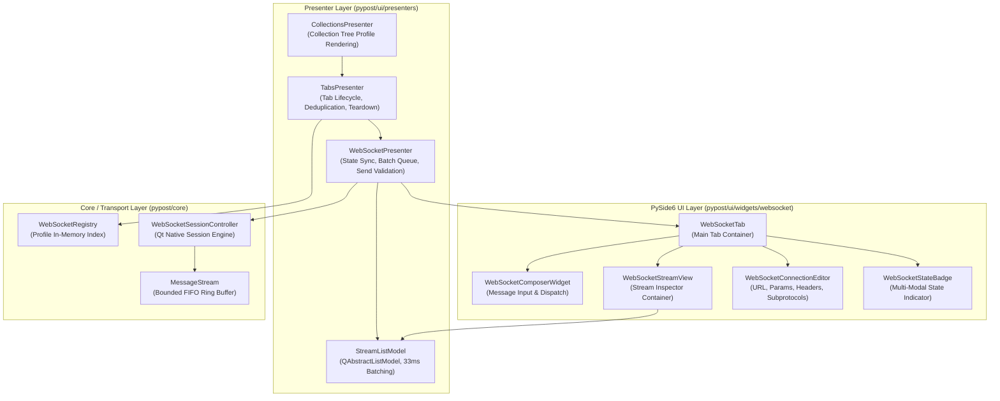
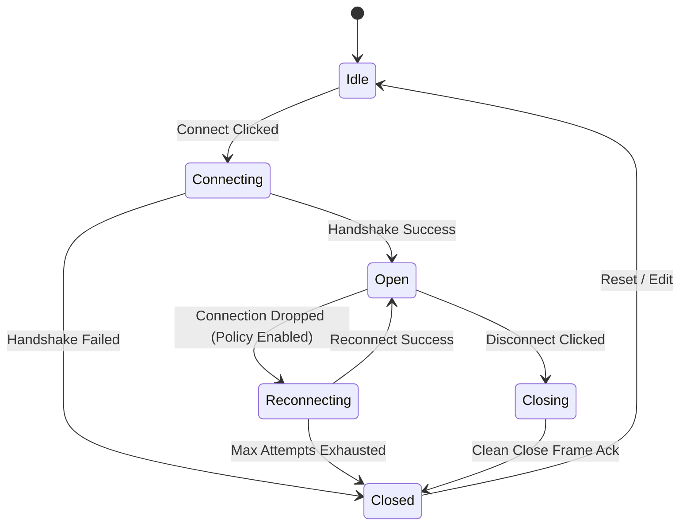

# WebSocket UI Client and Live Stream Inspector (PYPOST-1132)

## Overview

The WebSocket UI Client and Live Stream Inspector (**WS-4**, Epic PYPOST-1123, task PYPOST-1132) introduces an interactive desktop interface for configuring WebSocket connections, managing real-time bidirectional message exchanges, rendering live chronological frame streams, and inspecting protocol lifecycle state in PyPost.

### Key Capabilities

- **Dedicated WebSocket Tabs**: Tabbed interface integrated into PyPost's `TabsPresenter` alongside traditional HTTP request tabs.
- **Connection Configuration Editor**: Full control over target URL (`ws://` / `wss://`), URL query parameters, custom HTTP handshake headers, subprotocols, and session reconnection policies.
- **Live Stream Inspector**: Chronological virtualized frame list displaying message direction, timestamps, byte sizes, payload previews, and connection lifecycle events.
- **Multi-Modal State Badge**: Header-level visual indicator reflecting real-time connection status (`IDLE`, `CONNECTING`, `OPEN`, `CLOSING`, `CLOSED`, `RECONNECTING`) using distinct colors, text, and glyphs for accessibility.
- **33ms Batch Queue Ingestion**: Smooth ~30 FPS frame rendering queue preventing main Qt event loop starvation during high-throughput message bursts.
- **In-Memory Secret Masking**: Automatic redaction of sensitive environment variable values and hidden keys in message previews and URLs using `***`.
- **Dynamic Read-Only Locking**: Automatic field locking with visual banner during active connection sessions to prevent invalid in-flight mutations.
- **Collection Tree Integration**: Full support for opening, renaming, deleting, and managing WebSocket connection profiles within workspace collections.

---

## Architecture

### Component Hierarchy

### Module Responsibilities

| Module | Location | Primary Responsibilities |
|---|---|---|
| `WebSocketPresenter` | `pypost/ui/presenters/websocket_presenter.py` | Coordinates UI signals with `WebSocketSessionController`, validates send operations, applies secret masking, manages 33ms batch queue, and coordinates session teardown. |
| `WebSocketTab` | `pypost/ui/widgets/websocket/websocket_tab.py` | Root widget containing state header, connection configuration editor, stream inspector view, and message composer. |
| `WebSocketStateBadge` | `pypost/ui/widgets/websocket/state_badge.py` | Multi-modal status indicator rendering state glyphs, status text, active subprotocol, and message counts. |
| `WebSocketConnectionEditor` | `pypost/ui/widgets/websocket/connection_editor.py` | URL entry, query parameter table, request header table, subprotocol inputs, lock notice banner, and dynamic connect button. |
| `WebSocketStreamView` | `pypost/ui/widgets/websocket/stream_view.py` | Virtualized stream inspector with filtering, search, follow-tail, drop notice banner, and detail pane. See [websocket_stream_inspector.md](websocket_stream_inspector.md). |
| `WebSocketComposer` | `pypost/ui/widgets/websocket/composer.py` | Multi-format message authoring with real-time validation and quick preset/sequence controls. See [websocket_composer_presets_sequences.md](websocket_composer_presets_sequences.md). |
| `WebSocketPresetsPanel` | `pypost/ui/widgets/websocket/presets_panel.py` | Messages sub-tab in `WS_DETAIL_TABS` for saved message presets and multi-step sequence management. See [websocket_composer_presets_sequences.md](websocket_composer_presets_sequences.md). |
| `StreamListModel` | `pypost/ui/widgets/websocket/stream_model.py` | `QAbstractListModel` backing the stream view with 33ms batching, capacity eviction handling, and secret redaction. |
| `TabsPresenter` | `pypost/ui/presenters/tabs_presenter.py` | Tab create/close, blank-tab picker, registry-gated WS persist, dirty-close for unsaved drafts, teardown, restore. See [new_tab_protocol_picker.md](new_tab_protocol_picker.md) and [websocket_draft_tab.md](websocket_draft_tab.md). |
| `Widget IDs` | `pypost/ui/widget_ids.py` | Stable `WS_*` identifier constants for automated agent testing and UI hierarchy discovery. |

---

## Stable UI Identities (`widget_ids.py`)

All key widgets expose deterministic `objectName` identifiers following the `pypost_*` namespace and registered in `KEY_WIDGET_IDS`:

| Constant | ID Value | Description |
|---|---|---|
| `WS_TAB_PAGE` | `pypost_ws_tab_page` | Root `WebSocketTab` container |
| `WS_URL_INPUT` | `pypost_ws_url_input` | Target endpoint URL `QLineEdit` |
| `WS_CONNECT_BUTTON` | `pypost_ws_connect_button` | Primary polymorphic Connect/Disconnect `QPushButton` |
| `WS_STATE_BADGE` | `pypost_ws_state_badge` | Multi-modal `WebSocketStateBadge` |
| `WS_PARAMS_TABLE` | `pypost_ws_params_table` | Query parameters `QTableWidget` |
| `WS_HEADERS_TABLE` | `pypost_ws_headers_table` | Handshake headers `QTableWidget` |
| `WS_SUBPROTOCOLS_INPUT` | `pypost_ws_subprotocols_input` | Subprotocol list `QLineEdit` |
| `WS_DETAIL_TABS` | `pypost_ws_detail_tabs` | Query / Headers detail `QTabWidget` |
| `WS_STREAM_VIEW` | `pypost_ws_stream_view` | Chronological stream `QListView` |
| `WS_COMPOSER_EDIT` | `pypost_ws_composer_edit` | Outbound message text `QPlainTextEdit` |
| `WS_SEND_MESSAGE_BUTTON` | `pypost_ws_send_message_button` | Outbound message Send `QPushButton` |
| `WS_LOCK_NOTICE` | `pypost_ws_lock_notice` | Active session read-only notice banner |

---

## Session Lifecycle & Dynamic Locking

### State Transitions

### Read-Only Field Locking & Dynamic Button State

When a session enters `CONNECTING`, `OPEN`, or `RECONNECTING` states:
1. `WebSocketConnectionEditor.set_read_only(True)` is invoked.
2. The URL input, query parameters table, headers table, and subprotocols input are dynamically disabled to prevent invalid in-flight mutations.
3. The `WS_LOCK_NOTICE` banner (`"Connection configuration is locked while session is active."`) becomes visible.
4. The polymorphic `WS_CONNECT_BUTTON` dynamically updates its label and action: transitions from `"Connect"` to `"Cancel"` (during `CONNECTING`), `"Disconnect"` (during `OPEN` and `RECONNECTING`), and `"Closing..."` (during `CLOSING`).

When the session returns to `CLOSED` or `IDLE`:
1. `set_read_only(False)` re-enables all configuration fields.
2. `WS_LOCK_NOTICE` is hidden.
3. `WS_CONNECT_BUTTON` label returns to `"Connect"`.

---

## High-Throughput Stream Ingestion & Secret Redaction

### 33ms Batch Queue

To prevent Qt UI freezes during high-volume messaging (>1,000 msgs/sec):
- Incoming frames and lifecycle events are queued in an internal pending buffer.
- A single-shot `QTimer` set to 33 ms (~30 FPS) accumulates pending items.
- Upon timer trigger, items are flushed into `StreamListModel` via a single `beginInsertRows()` / `endInsertRows()` cycle.

### Secret Redaction

Before stream entries are added to the list model:
- `build_stream_entry(..., env_vars=..., hidden_keys=...)` redacts sensitive variable values (e.g. API keys, bearer tokens) with `***`.
- Masked previews are displayed in the stream list without leaking cleartext secrets.

---

## Blank-tab WebSocket entry (PYPOST-1157 / PYPOST-1158)

WS-TM-1 shipped the blank-tab protocol picker. MCP-TM-1
([PYPOST-1165](https://pypost.atlassian.net/browse/PYPOST-1165)) added
**MCP Client** as the third item. `Ctrl+N` and tab-bar **+** show
**HTTP Request** (default), **WebSocket**, then **MCP Client** before
any editor is created. Confirming WebSocket calls
`add_blank_websocket_tab()` (full `WebSocketTab`; not
`open_websocket_tab`). Confirming MCP Client opens a draft
`McpClientTab` ([mcp_client_draft_tab.md](mcp_client_draft_tab.md)).
Picker details: [new_tab_protocol_picker.md](new_tab_protocol_picker.md).

WS-TM-2 ([PYPOST-1158](https://pypost.atlassian.net/browse/PYPOST-1158))
owns draft **lifecycle**: registry-gated `save_tabs_state` (omit unsaved
ids; persist saved ids) and Discard/Keep on dirty unsaved close. Editor
chrome is unchanged. Details:
[websocket_draft_tab.md](websocket_draft_tab.md).

Saved profiles still open via `open_websocket_tab(profile)` from
Collections and session restore.

**Remaining implementation stories:**

| Story | Jira | Summary |
| --- | --- | --- |
| WS-TM-2 | [PYPOST-1158](https://pypost.atlassian.net/browse/PYPOST-1158) | Blank WebSocket draft lifecycle (**shipped**) |
| WS-TM-3 | [PYPOST-1159](https://pypost.atlassian.net/browse/PYPOST-1159) | Tab entry-point parity (close-last-tab picker) |
| WS-TM-4 | [PYPOST-1160](https://pypost.atlassian.net/browse/PYPOST-1160) | Collections WebSocket menu parity |
| WS-TM-5 | [PYPOST-1161](https://pypost.atlassian.net/browse/PYPOST-1161) | WebSocket save-to-collection flow (**shipped** — [websocket_save_flow.md](websocket_save_flow.md)) |
| WS-TM-6 | [PYPOST-1162](https://pypost.atlassian.net/browse/PYPOST-1162) | Context-aware WebSocket shortcuts |
| WS-TM-7 | [PYPOST-1163](https://pypost.atlassian.net/browse/PYPOST-1163) | User documentation alignment (**shipped** — `doc/user/websocket.md`, `interface.md`, `hotkeys.md`, `collections.md`; contract tests in `tests/test_websocket_tab_mode_user_docs.py`) |

Epic research:
[`ai-tasks/PYPOST-1156/20-architecture.md`](../../ai-tasks/PYPOST-1156/20-architecture.md).

---

## Tab Lifecycle and Deterministic Teardown

`TabsPresenter` manages WebSocket tab lifecycles:

1. **Tab Opening**:
   - `open_websocket_tab(profile)` creates a new `WebSocketTab` or
     focuses an existing tab if the profile ID is already open
     (Collections / restore).
   - Blank WebSocket tabs from the protocol picker use
     `add_blank_websocket_tab()` (no id dedup). See
     [new_tab_protocol_picker.md](new_tab_protocol_picker.md) and
     [websocket_draft_tab.md](websocket_draft_tab.md).
2. **Session persist**:
   - `save_tabs_state` appends a WebSocket id only when
     `WebSocketRegistry.find_websocket(id)` finds a collection profile.
     Unsaved draft UUIDs are omitted so they do not restore.
3. **Dirty-close (unsaved drafts only)**:
   - If the tab is not in the registry and editor fields differ from
     factory defaults, `prompt_unsaved_draft_tab_close` offers
     **Discard** or **Keep the tab**. Keep skips teardown. Saved
     profiles and factory-clean drafts close without the prompt.
4. **Deterministic Teardown**:
   - Closing a tab invokes `WebSocketPresenter.teardown()`, which immediately terminates active network sockets, cancels pending batch timers, and releases stream resources.
5. **Workspace Restoration**:
   - `restore_tabs()` safely instantiates saved WebSocket profiles in an `IDLE` disconnected state on application launch. Draft ids must not appear in `open_tabs`.

---

## Testing Strategy

| Test Suite | Purpose | Execution |
|---|---|---|
| `tests/test_websocket_client_ui_repro.py` | 23 comprehensive unit tests verifying widget hierarchies, state badges, locking, presenters, secret masking, and batching. | `.venv/bin/pytest tests/test_websocket_client_ui_repro.py` |
| `tests/test_agent_e2e_websocket.py` | End-to-end loopback integration test driving the full agent UI session. | `.venv/bin/pytest tests/test_agent_e2e_websocket.py` |
| `tests/test_ui_identity_spotcheck.py` | Validates `WS_*` objectName identity preservation across theme changes and multi-tab scenarios. | `.venv/bin/pytest tests/test_ui_identity_spotcheck.py` |
| `tests/test_tabs_presenter.py` | Blank WS draft omit from `open_tabs`, dirty Discard/Keep, saved-id persist, no-merge, INFO logs. | `make test PYTEST_ARGS="tests/test_tabs_presenter.py -k websocket_draft -v"` |
