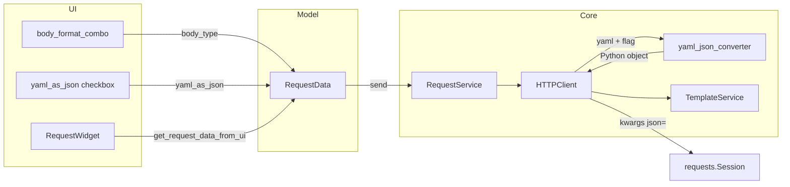

# YAML as JSON Conversion

## Overview

The Body tab includes an optional **YAML as JSON** checkbox. When enabled and the body format is
YAML, the application:

1. **Paste** — converts pasted JSON to YAML in the editor (`CodeEditor.insertFromMimeData`).
2. **Send** — converts editor YAML to JSON on the HTTP wire (`HTTPClient`).

Users can author payloads in YAML while pasting from JSON sources and targeting JSON-only APIs.

Behaviour:

- Checkbox enabled only when the format selector is **YAML**; greyed out for JSON and XML.
- Checked state is persisted on `RequestData.yaml_as_json` and restored when loading a request.
- Default is unchecked for new requests and requests without a saved preference.
- Editor text stays YAML after send; only the outgoing HTTP request uses the converted JSON.
- Invalid or non-serializable YAML surfaces a user-visible error; the request is not sent.
- When format is not YAML, the flag has no effect on send or paste (even if still checked in the
  model).
- Pasted non-JSON text is unchanged; invalid JSON paste falls back to default insert.
- Pasted text larger than **100KB** (102 400 characters):
  - If it does not look like JSON (after leading whitespace, does not start with `{` or `[`),
    raw clipboard text is inserted with no background work.
  - If it looks like JSON, raw text is inserted immediately on the UI thread, then
    `PasteJsonFormatWorker` parses and formats off-thread. On success, the inserted region is
    replaced with pretty-printed JSON (or YAML when **YAML as JSON** is on). If parse fails or
    the user edits the region before completion, raw text is kept.

See also [Body Format Selector](body_format_selector.md) for format persistence and
[Copy cURL](copy_curl.md) for cURL generation (cURL uses editor text, not converted JSON).

## Architecture



### Components

- **`RequestWidget` (`pypost/ui/widgets/request_editor.py`)** — `yaml_as_json_check` on the Body
  tab format row; load/save via `load_data`, `update_request_data`, `get_request_data_from_ui`;
  `setEnabled` when format is YAML; `_sync_yaml_as_json_to_editor` pushes flag to `CodeEditor`.
- **`CodeEditor` (`pypost/ui/widgets/code_editor.py`)** — `set_yaml_as_json`; paste hook converts
  JSON→YAML when format is YAML and flag is on, otherwise pretty-prints JSON. Paste at or below
  100KB is synchronous; larger JSON-like pastes use async format via `PasteJsonFormatWorker`
  (`_PASTE_JSON_FORMAT_CHAR_THRESHOLD`, `_looks_like_json`).
- **`PasteJsonFormatWorker` (`pypost/ui/widgets/paste_json_worker.py`)** — background
  `json.loads` + format for large pastes; signals formatted text back to `CodeEditor`.
- **`RequestData` (`pypost/models/models.py`)** — `yaml_as_json: bool = False`; serializes with
  existing collection storage (no migration).
- **`yaml_json_converter` (`pypost/core/yaml_json_converter.py`)** — `convert_yaml_body_to_object`
  for send; `convert_json_object_to_yaml` for paste; raises `YamlBodyConversionError` on send-path
  failure.
- **`HTTPClient` (`pypost/core/http_client.py`)** — Branch in `_prepare_request_kwargs` when
  `body_type == "yaml"` and `yaml_as_json` is true; raises `ExecutionError(BODY)` on conversion
  failure (increments `yaml_to_json_conversion_failed_total` when metrics are enabled).
- **`CurlGenerator` (`pypost/core/curl_generator.py`)** — Copy cURL uses the same YAML→JSON
  conversion for the `-d` body when `yaml_as_json` is enabled (history copy keeps stored body).
  failure.
- **`RequestService` (`pypost/core/request_service.py`)** — `ErrorCategory.BODY` is non-retryable
  in `_execute_http_with_retry` (re-raised immediately).
- **`tabs_presenter.py`** — User-facing `_ERROR_MESSAGES` entry for `ErrorCategory.BODY`.

### Send-time decision flow

```text
render body via TemplateService
        │
        ▼
body empty (whitespace only)? ──yes──► no body kwargs
        │ no
        ▼
body_type == "yaml" AND yaml_as_json?
        │
   no ──┴── yes
   │         │
   │         ▼
   │    convert_yaml_body_to_object(body)
   │         │
   │    fail ──► ExecutionError(BODY) — request NOT sent
   │         │
   │    ok ──► kwargs["json"] = parsed object
   │
   ▼
existing json / raw-data branches (unchanged)
```

### Key design decisions

1. **Send-time conversion in core, not UI** — `HTTPClient` already owns body serialization by
   `body_type`; conversion is another serialization rule.
2. **Reuse `kwargs["json"]` path** — Same as native JSON bodies; `requests` sets
   `Content-Type: application/json` automatically.
3. **Fail closed** — Invalid YAML raises before `session.request`; no silent fallback to raw YAML
   when conversion was requested.
4. **History and cURL show editor YAML** — Send path only; avoids surprising users who expect
   history to match what they typed.

## API / Usage

### `convert_yaml_body_to_object(text: str) -> Any`

Location: `pypost/core/yaml_json_converter.py`

Parses YAML text into a JSON-serializable Python object.

- Strips whitespace; blank body raises `YamlBodyConversionError`.
- Uses `yaml.safe_load_all` and **requires exactly one document** (rejects multi-document streams).
- Wraps `yaml.YAMLError` as `YamlBodyConversionError`.
- Validates JSON serializability with `json.dumps(parsed)` before returning.

```python
from pypost.core.yaml_json_converter import (
    YamlBodyConversionError,
    convert_yaml_body_to_object,
)

obj = convert_yaml_body_to_object("name: alice\nage: 30")
# {"name": "alice", "age": 30}
```

### `RequestData.yaml_as_json`

```python
yaml_as_json: bool = False
```

Read/written by `RequestWidget` on load and save/send. Ignored on send when `body_type != "yaml"`.

### `HTTPClient._prepare_request_kwargs`

When `body_type == "yaml"`, `yaml_as_json` is true, and the rendered body is non-empty:

```python
kwargs["json"] = convert_yaml_body_to_object(body)
```

On `YamlBodyConversionError`, logs `yaml_to_json_conversion_failed` and raises:

```python
ExecutionError(
    category=ErrorCategory.BODY,
    message="Could not convert YAML body to JSON.",
    detail=str(exc),
)
```

### UI wiring

Mirror `mcp_check` pattern in `RequestWidget`:

- `load_data`: `yaml_as_json_check.setChecked(request_data.yaml_as_json)` and
  `_update_yaml_as_json_enabled()`.
- `_on_body_format_changed`: `yaml_as_json_check.setEnabled(body_format == BodyFormat.YAML)` and
  `_sync_yaml_as_json_to_editor()`.
- `_on_yaml_as_json_toggled` / `load_data`: sync checkbox to `body_edit.set_yaml_as_json`.
- `update_request_data` / `get_request_data_from_ui`: read checkbox into `yaml_as_json`.

When the checkbox is disabled (non-YAML format), checked state is still persisted in
`RequestData`.

## Configuration

| Item | Value |
| --- | --- |
| Dependency | `PyYAML` in `requirements.txt` |
| Parser | `yaml.safe_load_all` only (never `yaml.load`) |
| Default | `yaml_as_json = False` |
| Metrics | None (low-value UI control; same as format selector) |

No environment variables or app settings.

## Observability

- **ERR** (`http_client.py`): `yaml_to_json_conversion_failed` with `method`, `url`, `detail` on
  conversion failure (never logs body content).
- **ERR** (`tabs_presenter.py`): `request_error` with `category=body` when the user sees the error
  dialog.

BODY errors do not trigger retry metrics or `track_retry_attempt`.

## Troubleshooting

### Request not sent — "Could not convert YAML body to JSON"

- Check YAML syntax (indentation, colons, quotes).
- Ensure the body is a **single** YAML document (no `---` multi-document streams).
- Avoid YAML types that are not JSON-serializable after parse (e.g. `datetime` objects).
- Confirm the checkbox is enabled and format is YAML.

### Checkbox is greyed out

Expected when body format is JSON or XML. Switch format to YAML to enable conversion. A previously
checked state remains in `RequestData` but has no send effect until format is YAML again.

### API receives YAML instead of JSON

- Verify **YAML as JSON** is checked.
- Verify format selector shows **YAML** (`body_type == "yaml"`).
- Confirm the body is non-empty after template rendering.

### Editor shows YAML but I expected history/cURL to show JSON

By design, history and Copy cURL use the editor (YAML) text, not the wire JSON. Only the HTTP
request body is converted at send time.

### Request retries on invalid YAML with a retry policy

`ErrorCategory.BODY` is non-retryable. If retries occur, check that `request_service.py` re-raises
BODY errors before the retry loop. See `tests/test_retry.py`.

## Tests

| File | Coverage |
| --- | --- |
| `tests/test_yaml_json_converter.py` | YAML parse + `convert_json_object_to_yaml` round-trip |
| `tests/test_http_client.py` | Send with flag on/off, ignored for JSON/XML, BODY error path |
| `tests/test_code_editor.py` | JSON→YAML paste when flag on; JSON format unchanged; large paste skip |
| `tests/test_request_editor_body_format.py` | Checkbox persistence, enabled-state, editor sync |
| `tests/test_retry.py` | BODY errors do not retry |

```bash
QT_QPA_PLATFORM=offscreen .venv/bin/python -m pytest \
  tests/test_yaml_json_converter.py \
  tests/test_http_client.py \
  tests/test_code_editor.py -k mime \
  tests/test_request_editor_body_format.py \
  tests/test_retry.py -k body
```

## Related tickets

- **PYPOST-513** — Body format selector (`body_type`).
- **PYPOST-514** — YAML-as-JSON send conversion (this feature).
- **PYPOST-515** — Paste-time JSON→YAML in editor when checkbox is on (shares `yaml_as_json` flag).
- **PYPOST-109** — Bound synchronous paste-time JSON handling to ≤100KB.
- **PYPOST-111** — Async JSON parse/format for large JSON-like pastes above 100KB.
